# 组件需求单

《正式版架构》第 8 章第 9 条的产物：把黑客松版客户端里所有按钮、边框、面板、弹窗
逐个截图、比对、去重，编成带编号的变体。那份客户端已经随第 38 条删掉，
这份清单和下面这批截图就是它留下的全部记录（源码去版本历史里翻）。
这份清单是 `canvas`（Pixi）和 `ui`（React）两个组件库的需求输入——第 17、28~31 条按场景
逐步实现时，从这里挑变体，不再另起炉灶（7.1 第 1、2 条）。

**这是需求，不是设计定稿。** 旧版怎么长的就怎么记，包括那些明显该合并的重复；
该合并的写在文末「去重记录」里，该补的令牌写在「令牌缺口」里。

**2026-09-12（简化第 3 步）：`ui` 那一半现在全是素方块。** React 组件库的样式整个剥掉了
（颜色、字体、圆角、阴影、动画、图标一样不剩，只留摆位），编号变体也不再有第二档可选。
所以下面每条里「归 ui」的落地记录说的是**剥之前**的样子——那些数值仍然是有效的需求输入，
视觉整套重做时从这里重新挑。

**2026-09-12（简化第 4 步之一）：首页、房间页、开包页这三页在 `canvas` 里也剥成素方块了。**
画布这边立了一个通用原语 `Box`（1px 描边矩形加一行字，见 `canvas/src/components/Box.ts`），
这三页的按钮、面板、文字全换成它；只服务这三页的组件（`PlateButton`、画布版 `SealButton`）
连同它们的底图素材一起删了。对局页、组牌页、选英雄页还没动（简化第 4 步余下三个 PR）。

## 怎么用

- 截图在 `docs/design/inventory/`，文件名是「幕名\_\_元件名[--状态].webp」，
  改名之前先看一眼本文档。**重拍不了了**：拍它们的脚本驱动的是黑客松版界面，
  那套界面和脚本都随第 38 条删掉了，这批图从此只读。
- 桌面档 1440×900 拍元件和整页，手机档 390×844（横屏对局那两幕是 844×390）只拍整页——
  旧版是 1672×941 的死版式整体等比缩放，手机上不是另一套版式而是同一套被缩小，
  需求第 3 条要的「两档并列」在这里恰恰是一条要改掉的现状。
- 状态矩阵的记号：**✓** 已截到 · **✗** 未截到（要凑的局面这次没凑出来）· **—** 不适用。
- 编号按类型各自从 A 排。《正式版架构》7.1 举的例子是「按钮 A、B、C，边框 X、Y、Z」，
  那里的 X/Y/Z 只是说明「变体要编号」，不是要求边框从 X 开始；十类元件各排一套字母更好记。

## 总表

82 个变体。「界面数」就是各变体「出现在」那一行数出来的界面个数；对局内的回合结算和
终局结算各算一个界面；`/design`、`/dev`、`/loader`、`/loading-bar` 这几个开发页不计
（它们不是玩家走得到的界面，只当取景用）。

| 编号 | 别名 | 类型 | 归属 | 界面数 |
| --- | --- | --- | --- | --- |
| 按钮 A | 墨蓝匾额 | 按钮 | 两边都要 | 6 |
| 按钮 B | 纸白匾额 | 按钮 | canvas | 1 |
| 按钮 C | 陶橙匾额 | 按钮 | canvas | 1 |
| 按钮 D | 象牙匾额 | 按钮 | canvas | 1 |
| 按钮 E | 首页开始匾额 | 按钮 | canvas | 1 |
| 按钮 F | 图片底板按钮 | 按钮 | canvas | 1 |
| 按钮 G | 线框图标钮 | 按钮 | canvas | 1 |
| 按钮 H | 图标加文字钮 | 按钮 | 两边都要 | 4 |
| 按钮 I | 首页导航文字项 | 按钮 | canvas | 1 |
| 按钮 J | 夜色圆章图标钮 | 按钮 | 两边都要 | 5 |
| 按钮 K | 纸面无底图标钮 | 按钮 | canvas | 3 |
| 按钮 L | 线框小钮 | 按钮 | canvas | 1 |
| 按钮 M | 实心墨块钮 | 按钮 | ui | 2 |
| 按钮 N | 下划线文字钮 | 按钮 | ui | 2 |
| 按钮 O | 引导下一步钮 | 按钮 | canvas | 1 |
| 边框 A | 双线雕花框 | 边框和花饰 | 两边都要 | 3 |
| 边框 B | 纸面卡框 | 边框和花饰 | canvas | 1 |
| 边框 C | 星芒细线花饰 | 边框和花饰 | canvas | 3 |
| 边框 D | 区块标题线 | 边框和花饰 | 两边都要 | 3 |
| 边框 E | 中线横杆 | 边框和花饰 | canvas | 1 |
| 边框 F | 分隔线加宝石 | 边框和花饰 | canvas | 2 |
| 边框 G | 竖向分隔花饰 | 边框和花饰 | canvas | 1 |
| 边框 H | 页脚花饰 | 边框和花饰 | canvas | 1 |
| 面板 A | 纸面页底 | 面板和底板 | 两边都要 | 3 |
| 面板 B | 纸面侧栏底板 | 面板和底板 | canvas | 2 |
| 面板 C | 纸面顶栏 | 面板和底板 | canvas | 2 |
| 面板 D | 夜色卡池底板 | 面板和底板 | canvas | 1 |
| 面板 E | Token 细条 | 面板和底板 | canvas | 1 |
| 面板 F | 下一题纸匾 | 面板和底板 | canvas | 1 |
| 面板 G | 对方回合吊匾 | 面板和底板 | canvas | 1 |
| 面板 H | 羊皮纸结算底板 | 面板和底板 | ui | 1 |
| 面板 I | 结算全屏纸底 | 面板和底板 | canvas | 1 |
| 面板 J | 标准答案框 | 面板和底板 | canvas | 1 |
| 面板 K | 作答结果卡 | 面板和底板 | canvas | 1 |
| 面板 L | 图片底板 | 面板和底板 | canvas | 1 |
| 面板 M | 技能说明卡背 | 面板和底板 | canvas | 1 |
| 面板 N | 英雄详情信息栏 | 面板和底板 | canvas | 1 |
| 面板 O | 人物介绍卡 | 面板和底板 | canvas | 1 |
| 弹窗 A | 纸面对话框 | 弹窗和浮层 | ui | 3 |
| 弹窗 B | 卡牌放大浮层 | 弹窗和浮层 | canvas | 3 |
| 弹窗 C | 英雄详情浮层 | 弹窗和浮层 | canvas | 2 |
| 弹窗 D | 引导挖洞遮罩 | 弹窗和浮层 | canvas | 1 |
| 弹窗 E | 结算遮罩 | 弹窗和浮层 | ui | 1 |
| 弹窗 F | 抛硬币过场 | 弹窗和浮层 | canvas | 2 |
| 弹窗 G | 选目标层 | 弹窗和浮层 | canvas | 1 |
| 徽章 A | 费用圆章 | 徽章和圆章 | canvas | 4 |
| 徽章 B | 问号帮助圆章 | 徽章和圆章 | canvas | 2 |
| 徽章 C | 卡面铭牌 | 徽章和圆章 | canvas | 4 |
| 徽章 D | 卡角状态角标 | 徽章和圆章 | canvas | 1 |
| 徽章 E | 中线回合徽章 | 徽章和圆章 | canvas | 1 |
| 徽章 F | 轮次药丸 | 徽章和圆章 | canvas | 1 |
| 徽章 G | 领先徽章 | 徽章和圆章 | canvas | 1 |
| 徽章 H | 对错判定块 | 徽章和圆章 | canvas | 1 |
| 徽章 I | 敬请期待角标 | 徽章和圆章 | canvas | 1 |
| 徽章 J | 拱窗名牌 | 徽章和圆章 | canvas | 0 |
| 徽章 K | 回合小匾 | 徽章和圆章 | canvas | 0 |
| 徽章 L | 状态圆点 | 徽章和圆章 | canvas | 1 |
| 徽章 M | 数据标签 | 徽章和圆章 | ui | 1 |
| 条 A | 牌组进度条 | 条 | canvas | 1 |
| 条 B | 素材加载进度条 | 条 | ui | 7 |
| 条 C | 法力计 | 条 | canvas | 0 |
| 条 D | 卡牌加载动画 | 条 | ui | 7 |
| 条 E | 三点等待动画 | 条 | canvas | 1 |
| 标签页 A | 药丸卡组页签 | 标签页 | canvas | 1 |
| 标签页 B | 纸页签 | 标签页 | canvas | 1 |
| 标签页 C | 描边胶囊筛选 | 标签页 | canvas | 1 |
| 标签页 D | 阵营侧条 | 标签页 | canvas | 1 |
| 列表 A | 卡槽网格 | 列表和表格 | canvas | 2 |
| 列表 B | 结果卡纵列 | 列表和表格 | canvas | 1 |
| 列表 C | 步骤条 | 列表和表格 | canvas | 1 |
| 列表 D | 信息页文字行 | 列表和表格 | ui | 1 |
| 列表 E | 数据对照表 | 列表和表格 | ui | 1 |
| 提示 A | 面板内嵌提示条 | 提示和横幅 | canvas | 1 |
| 提示 B | 浮起小气泡 | 提示和横幅 | canvas | 3 |
| 提示 C | 喊话气泡 | 提示和横幅 | canvas | 1 |
| 提示 D | 带圆点状态行 | 提示和横幅 | canvas | 1 |
| 提示 E | 错误红字 | 提示和横幅 | 两边都要 | 3 |
| 提示 F | 等待页 | 提示和横幅 | canvas | 1 |
| 图标 A | 纸面手绘图标集 | 图标 | 两边都要 | 2 |
| 图标 B | 控件线稿图标 | 图标 | 两边都要 | 7 |
| 图标 C | 星芒与菱形 | 图标 | 两边都要 | 4 |
| 卡牌 A | 卡面 · 牌背 · 扇形 | 卡牌 | canvas | 5 |

## 两档版式对照

同一个界面的桌面档和手机档摆在一起，看的是「旧版没有手机版式」这件事本身。

| 界面 | 桌面 1440×900 | 手机 390×844 |
| --- | --- | --- |
| 首页 |  |  |
| 匹配房 | 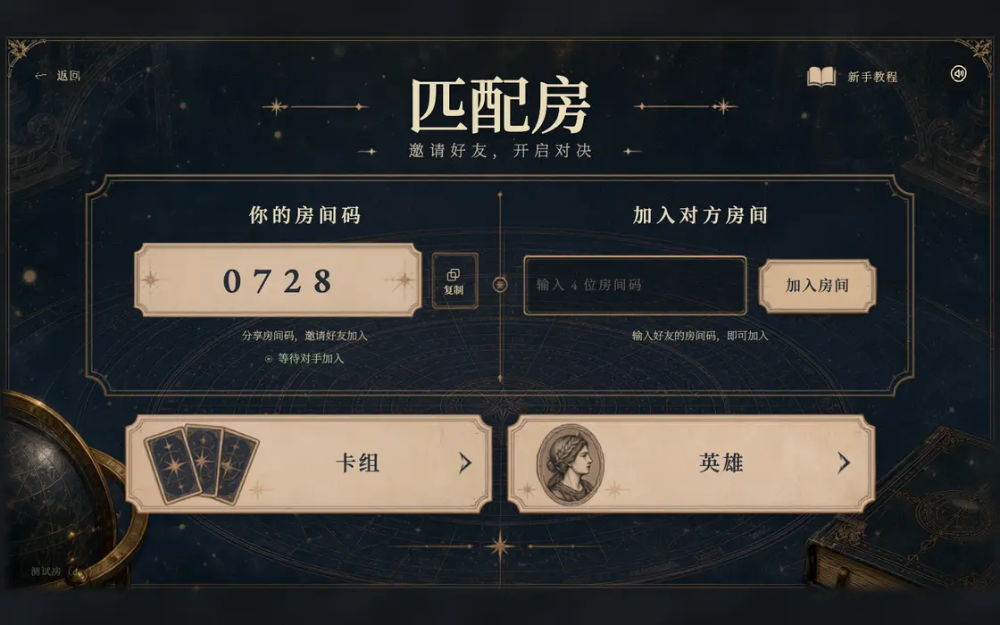 | 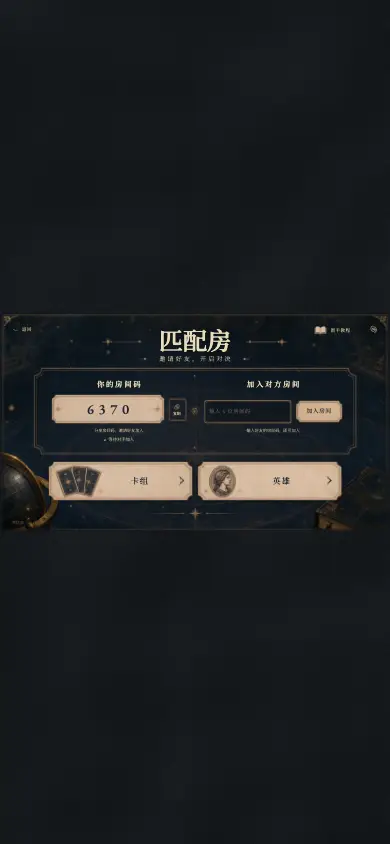 |
| 组牌 | 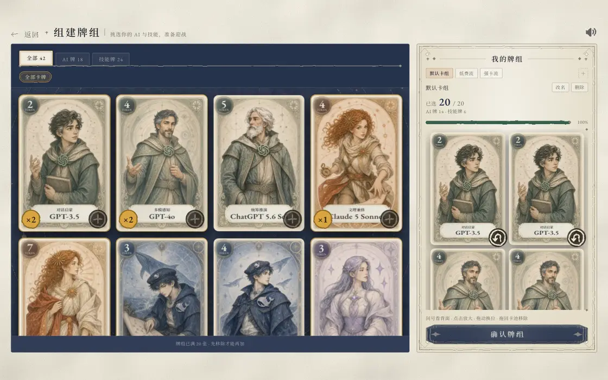 | 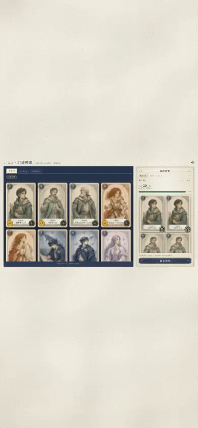 |
| 对局 | 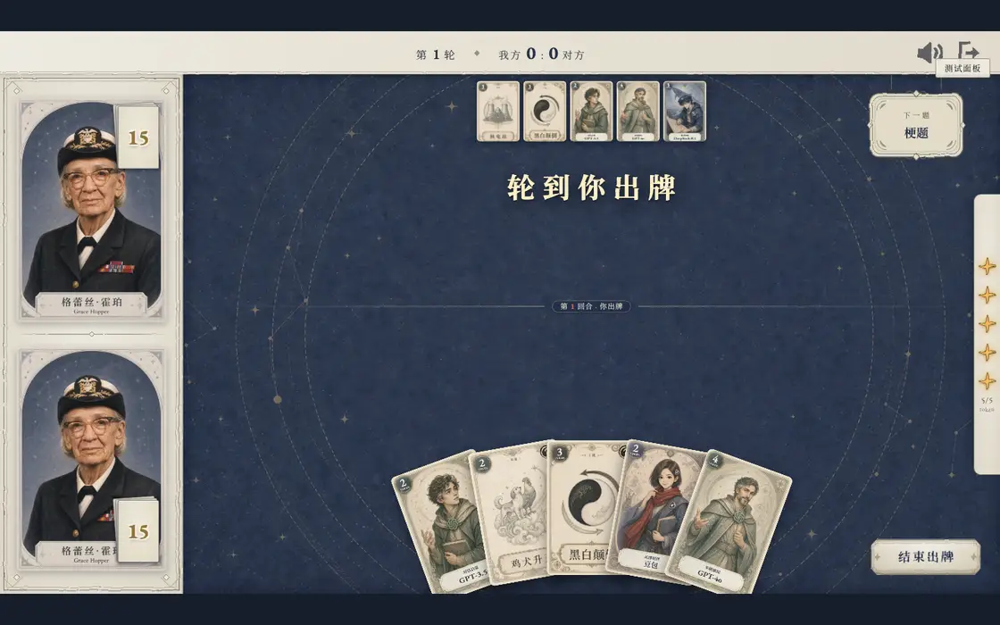 | 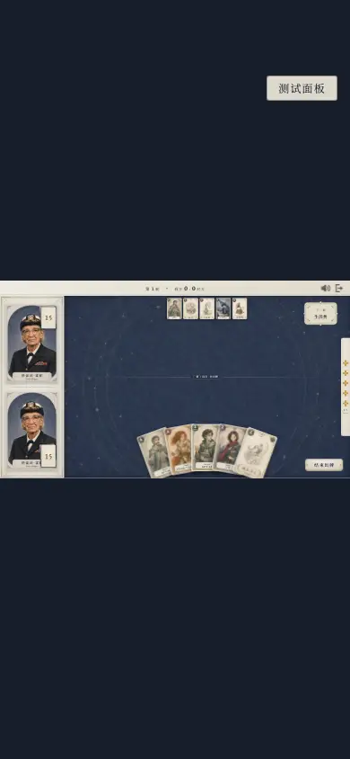 |
| 回合结算 | 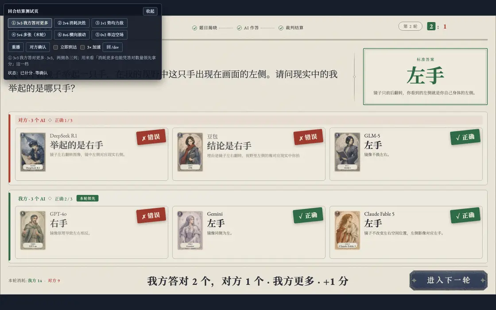 | 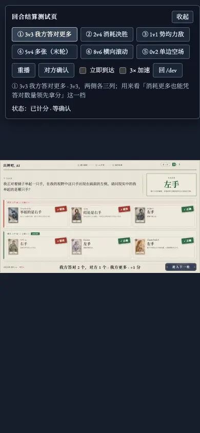 |
| 选英雄 |  | 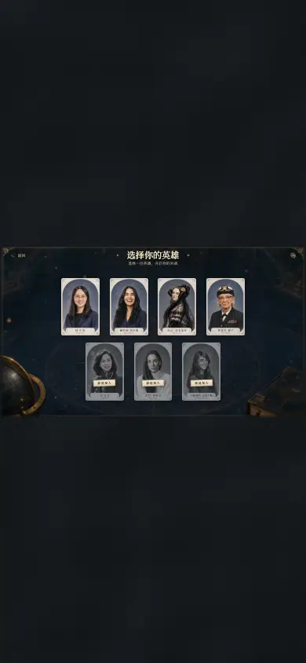 |
| 信息页 |  | 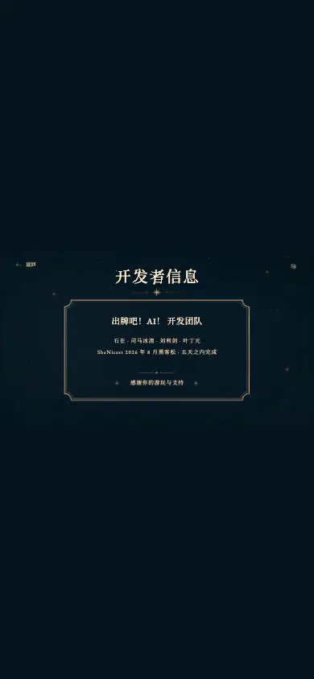 |
| 终局结算 | 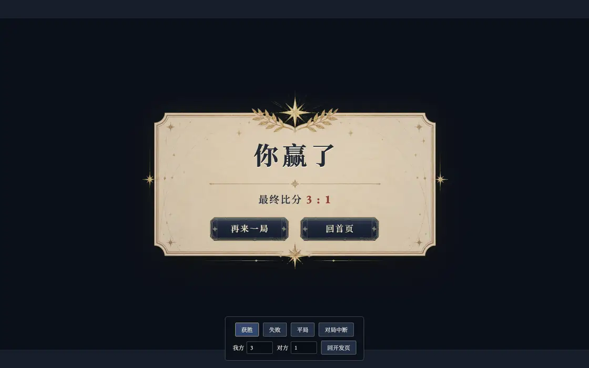 | 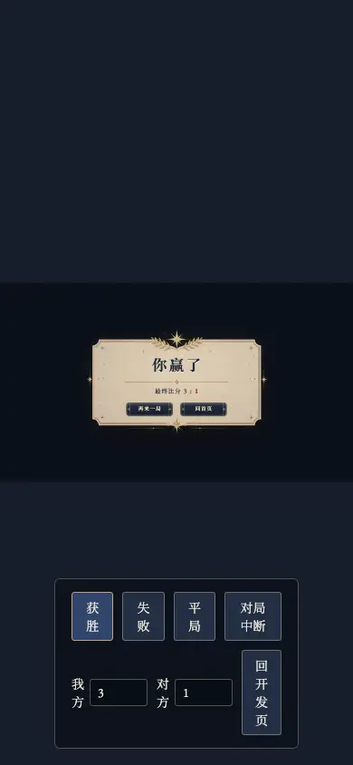 |
| 生成对照页 | 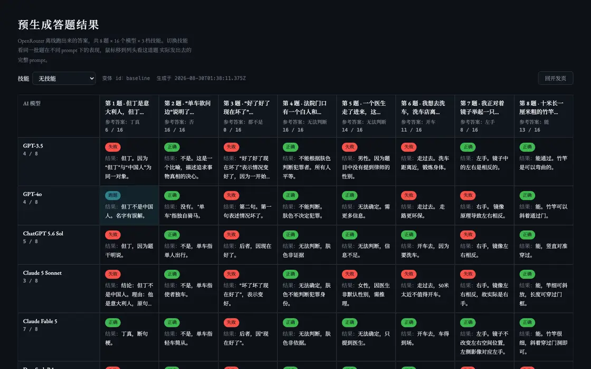 | 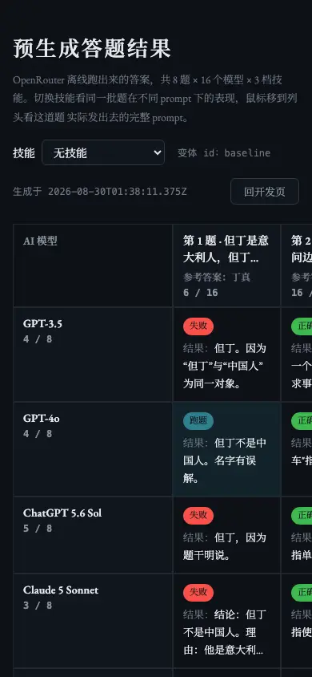 |
| 教学开始页 | 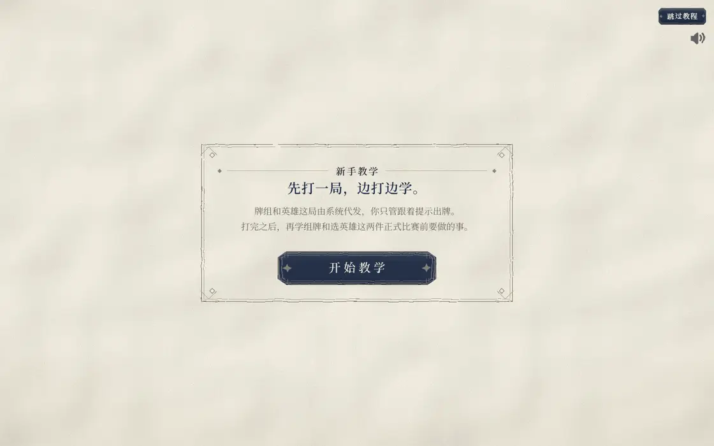 | 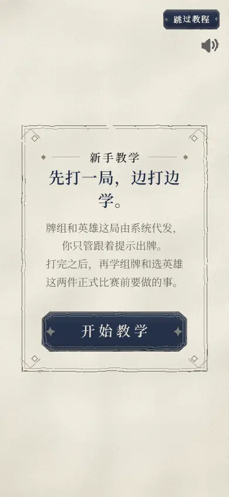 |

只在手机档出现的两幕：竖屏提示 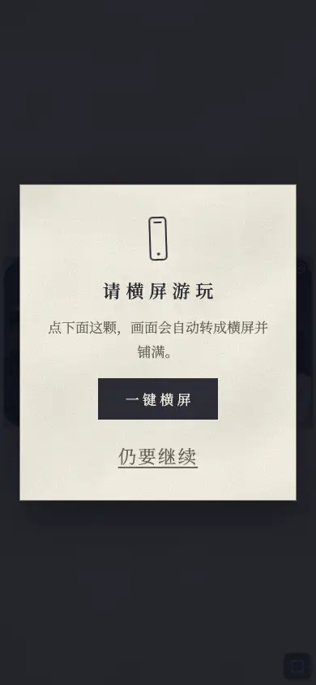
和进对局时的全屏提示 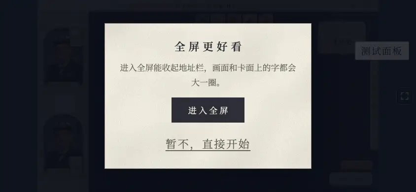。

结论写在这儿，省得每个变体里重复：**旧版整页只有一套版式**，手机档是同一张 16:9 舞台
缩到屏幕里，字号、留白、命中区全跟着缩。正式版这十个界面都要按两档分别排，
本需求单里每个变体的尺寸都只是**桌面档的现状值**，不是要照抄的目标值。

---

## 一、按钮

### 按钮 A（墨蓝匾额）

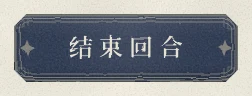

- **用途**：全站主操作键——确认、开始、结束、离开。
- **出现在**：对局（结束出牌的底座、离开确认弹窗里的取消/确认）、组牌页（确认牌组）、
  选英雄页（确认英雄的底座）、回合结算（确认）、终局结算（再来一局 / 回首页）、
  新手教程（开始教学 / 跳过教程 / 确定 / 取消）。
- **状态**：普通 ✓ · 悬停 ✓ · 按下 ✓ · 禁用 ✓ · 加载 —
  （`design__plaque-navy--hover` / `--press`，禁用是 `design__plaque-navy-disabled`。
  会跳页的那几颗不排「按下」，见去重记录第 6 条。）
- **尺寸和关键值**：默认 224×68，`padding: 0 30px`，24px/600 字、字距 0.25em；
  八角外形由 `clip-path` 切出，不是圆角；底 `#253149`、描边 `#77766f`、内线
  `rgb(174 168 151 / 62%)`、字 `#e7e1d4`；悬停底 `#2c3953`、内线转暖 `rgb(203 157 123 / 85%)`、
  字 `#ead0b9`；按下 `translateY(6px) scaleY(0.96)`，220ms 弹性曲线，最短压入 70ms；
  禁用底 `#676965` 加 `saturate(0.25)`。框线是内联 SVG（三道细线 + 四角折线 + 左右星芒），
  整块套 `#ai-duel-rough-button` 手绘位移滤镜。
- **归属**：**两边都要**。对局、组牌、英雄、教程在 `canvas`；离开确认弹窗是纯文字弹窗，
  归 `ui`。
- **旧组件**：`src/ui/PlaqueButton.tsx` + `styles.css` 的 `.plaque-button`。

### 按钮 B（纸白匾额）

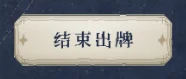

- **用途**：压在纸面上的悬浮操作键，和墨蓝匾额是同一副骨架、另一套配色。
- **出现在**：对局（右下角「结束出牌 / 等待对方… / 答题中…」、手牌上方那颗「打出」）。
- **状态**：普通 ✓ · 悬停 ✓ · 按下 ✓ · 禁用 ✓ · 加载 —
- **尺寸和关键值**：结束出牌 184×60、`padding: 0 14px`、20px 字、字距 0.2em；
  「打出」132×46、18px 字、字距 0.22em（触屏才有，见 `battle-touch__hand-play`）。
  底 `--battle-paper-shade #e2dbc8`、描边 `--battle-line-dark #777465`、
  内线 `rgb(120 100 66 / 55%)`、字 `--battle-navy #253149`；底纹混合模式从 screen 换成
  multiply（纸色上 screen 会洗成全白）；悬停底 `#f2ead7`、字压到 `#1b2434`；
  禁用底 `#ded9cd`、字 `#8b8a84`、`saturate(0.3) brightness(0.98)`。
- **归属**：`canvas`。
- **旧组件**：`PlaqueButton` + `styles.css` 的 `.battle__end-turn`、`.hand-fan__play`。
- **部分已删（简化第 4 步之二）**：对局页那两处（「结束出牌」、英雄技能钮）换成 `Box`。
  `PlaqueButton` 本身还在——组牌页和选英雄页还在用。

### 按钮 C（陶橙匾额）

- **用途**：唯一一颗「催促对方」的次要操作键，配色刻意和主操作拉开。
- **出现在**：对局（等对方出牌时右下角的「催一催」）。
- **状态**：普通 ✗ · 悬停 ✗ · 按下 ✗ · 禁用 ✗ · 加载 —
  **未截到**：只在 `waitingForFoe` 那段时间挂出来，本地测试局里对方没人操作，凑不到这个局面。
- **尺寸和关键值**（读自 `styles.css` 的 `.battle__urge .plaque-button`）：154×48、
  `padding: 0 16px`、19px 字、字距 0.24em；底 `#b77f5f`、描边 `#6f4f3e`、
  内线 `rgb(244 213 181 / 62%)`、字 `#fff1dc`；悬停底 `#c28a68`、字 `#fff7e8`；
  禁用底 `#9b887c`、字 `#d8cec2`、`saturate(0.35)`。
- **归属**：`canvas`。
- **旧组件**：`PlaqueButton` + `styles.css` 的 `.battle__urge .plaque-button`。
- **已删（简化第 2 步）**：「催一催」整条链下线（按钮、气泡、协议、台词、人声），这颗钮不做了。
  陶橙这档配色本身留着——对局右下角那颗「结束出牌」在代码里走的就是 `PlaqueButton` 的变体 C。
  随按钮一起删的是它的尺寸档（`PLAQUE_SIZES.urge`），所以令牌
  `size.plaque.urgeWidth` / `urgeHeight` 现在没人用了。

### 按钮 D（象牙匾额）

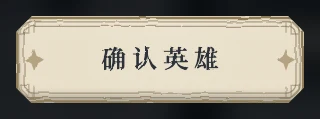

- **用途**：夜色页面上的主操作键——底色比纸白更暖更实，才压得住星空底。
- **出现在**：选英雄页（确认英雄 / 返回）。
- **状态**：普通 ✓ · 悬停 ✓ · 按下 ✗（会跳页，见去重记录第 6 条）· 禁用 ✓ · 加载 —
- **尺寸和关键值**：288×87（尺寸写成 cqi，跟着舞台缩放，不是固定 px）；24.8px/600 字、
  字距 0.25em；底 `#e7ddc6`、描边 `#8f7c56`、内线 `#786442`、字 `#2c3138`；
  悬停底 `#f2e9d5`。四角折线和星芒也压深了一档（`.plaque-button` 里那套浅灰是配墨蓝底的）。
- **归属**：`canvas`。
- **旧组件**：`PlaqueButton` + `screens/hero.css` 的 `.hero__confirm`、`.hero__return`。
- **落地（第 29-30 条）**：`PlaqueButton` 的变体 D，只挑令牌不挑代码路径
  （`color.plaque.ivory.*` 在第 17 条就存进去了，这一条只是把它接上）。
  尺寸另设一档 `hero`（288×87）。禁用色沿用纸白那一档：旧样式压根没写过它的禁用态。

### 按钮 E（首页开始匾额）

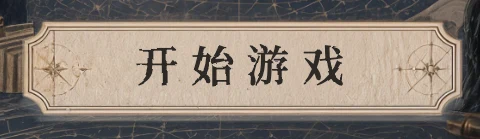

- **用途**：首页唯一的主入口，整颗是一张切片素材。
- **出现在**：首页（开始游戏）。
- **状态**：普通 ✓ · 悬停 ✓ · 按下 ✗（按下会跳页）· 禁用 — · 加载 —
- **尺寸和关键值**：宽 31.16% 舞台宽、`aspect-ratio: 521 / 125`（桌面档约 449×108）；
  背景是 `/home/home-plaque.webp`（2x 导出 1042×250）；字 43.2px/600、字距 0.28em、
  色 `#2c2926`；常驻 3.2s 上下浮动动画，悬停 0.16s 放大加提亮。
- **归属**：`canvas`。
- **旧组件**：`screens/HomeScreen.tsx` + `styles.css` 的 `.home__start`。
- **落地（第 29-30 条）**：`PlateButton` 的变体 E。和按钮 F 合成一个组件——两者都是
  「一张画好的底图 + 一行居中文字」，只差 E 自带那条常驻浮动。
  旧样式那句 `filter: brightness(1.08)` 换成往白里提一档 tint（不挂 Filter，纪律 3.1）。
- **已删（简化第 4 步）**：首页剥成素方块，这颗匾额换成一块 `Box`，底图 `/home/home-plaque.webp`
  和整个 `PlateButton` 组件一起删了。那条常驻浮动也没了——它正是首页帧循环从来停不下来的原因。

### 按钮 F（图片底板按钮）

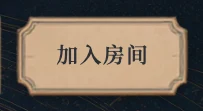 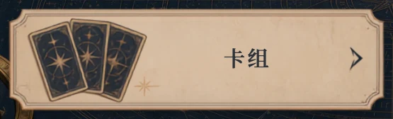

- **用途**：匹配房里靠切片素材拼出来的按钮，一张底图加一行居中文字。
- **出现在**：匹配房（加入房间 176×84、卡组横幅 535×148、英雄横幅 535×148）。
- **状态**：普通 ✓ · 悬停 ✓ · 按下 ✗ · 禁用 ✓ · 加载 ✓
  （加载态就是文案换成「加入中…」，和禁用同时出现）。
- **尺寸和关键值**：底图分别是 `/room/join-btn.webp`、卡组 / 英雄横幅原画；
  文字 21.6px/600（加入）、30.2px/600（横幅），字距 0.08~0.12em、色 `#2c3138`；
  横幅的文字靠左侧 191px 内边距让开原画里的插图。
- **归属**：`canvas`。
- **旧组件**：`screens/RoomScreen.tsx` 的 `.room__join`、`.room__banner`。
- **已删（简化第 4 步）**：这一档从来没落地过（`PlateButton` 只做了变体 E），
  房间页现在是素方块，`/room/` 那十四张切片整批删了，组件也跟着删。

### 按钮 G（线框图标钮）

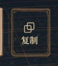

- **用途**：图标在上、文字在下的小型次要操作，外面套一圈素材线框。
- **出现在**：匹配房（复制房间码）。
- **状态**：普通 ✓ · 悬停 ✓ · 按下 ✗ · 禁用 ✓ · 加载 —
  （按下后文案变「已复制」，属于结果反馈不是状态，未单独截。）
- **尺寸和关键值**：76×88；线框是 `/room/copy-frame.webp`；文字 14.4px/600、色 `#c9b48c`。
- **归属**：`canvas`。
- **旧组件**：`screens/RoomScreen.tsx` 的 `.room__copy`。

### 按钮 H（图标加文字钮）

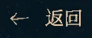 

- **用途**：左上角那类「箭头 + 文字」的返回，以及和它同一套排版的图标入口。
- **出现在**：信息页、匹配房（返回 / 新手教学）、选英雄页（返回 / 详情里的返回）、
  组牌页（返回 / 放大侧栏里的返回）。
- **状态**：普通 ✓ · 悬停 ✓ · 按下 ✓（信息页那颗）· 禁用 — · 加载 —
- **尺寸和关键值**：箭头是内联 SVG（`viewBox 0 0 23 15`、1.3 描边、`currentColor`），
  悬停时箭头往左挪。**颜色由使用方给**，共三档：夜色页金 `#e8c69f` / `#c9b48c`（信息页
  23px 字、匹配房和英雄页 16.6px 字）、纸面墨 `#6b6a5f`（组牌页 19px 字）、
  深底米白 `rgba(239 233 216 / 78%)`（放大侧栏 15px 字）。字距 0.1em 上下。
- **归属**：**两边都要**。信息页归 `ui`，匹配房 / 英雄 / 组牌归 `canvas`。
- **旧组件**：`src/ui/BackButton.tsx` + `styles.css`「可复用返回按钮」一节；
  匹配房那颗书本入口是 `RoomScreen` 里手写的 `.room__tutorial`，样式和返回按钮同一套。

### 按钮 I（首页导航文字项）

- **用途**：首页底部那排纯文字菜单，项与项之间用一颗星芒隔开。
- **出现在**：首页（牌组 / 英雄 / 信息）。
- **状态**：普通 ✓ · 悬停 ✓ · 按下 ✗ · 禁用 — · 加载 —
- **尺寸和关键值**：28.8px 字、字距 0.24em、色 `#e8c69f`，上下内边距 17.3px；
  分隔星芒 15.8×15.8，`opacity 0.7`；悬停整行提亮到 `#fbe6c4`。
- **归属**：`canvas`。
- **旧组件**：`screens/HomeScreen.tsx` 的 `.home__nav-item`、`.home__nav-dot`。
- **落地（第 29-30 条）**：`TextButton` 的变体 I，和按钮 H（返回）合成一个组件。
  分隔星芒走 `ui.sparkle` 那张预烤纹理（图标 C）。**手机档不摆星**：竖排时它变成
  「每行之间塞一颗」，很吵。
- **部分已删（简化第 4 步）**：首页那排文字菜单换成一列 `Box`，分隔星芒跟着没了。
  `TextButton` 本身还在——选英雄页的返回钮（按钮 H）用的是同一个组件。

### 按钮 J（夜色圆章图标钮）

 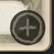

- **用途**：深色底上的图标开关和加减钮，长相是一枚「夜色圆底 + 米色线条」的圆章。
- **出现在**：首页、信息页、匹配房、选英雄页（静音钮）、组牌页（卡池加 / 牌组减）。
- **状态**：普通 ✓ · 悬停 ✓ · 按下 ✓（静音钮）· 禁用 ✓（加钮在卡池满时压到
  `opacity 0.34`，见 `deck__circle-add`）· 加载 —
- **尺寸和关键值**：圆底 `rgb(20 17 12 / 78%)`、`border-radius: 50%`、线条 `#f3ead6`；
  直径按页面给：首页 51.8、信息 / 匹配房 / 英雄 34.5、组牌加减钮 44.8。
  图形是内联 SVG，套 `#ai-duel-rough-icon` 手绘滤镜（不用字体里的 🔇/🔊，各系统画风差太远）。
- **归属**：**两边都要**。信息页归 `ui`，其余归 `canvas`。
- **落地（第 31 条，`ui` 这一半）**：`ui` 的 `SealButton`（信息页页眉那颗静音圆章、
  全屏入口那颗）。和画布那颗读同一批 `color.seal.*` 令牌，配色只有一处出处。
- **落地（第 29-30 条）**：组件 `SealButton`（首页和选英雄页的静音钮）。
  圆底和外圈走第 17 条就烤好的 `sealDisc` / `sealRing`，命中区是那枚**圆**不是外接方框。
  中间那枚剪影现在是画出来的占位（`fx/controlIcons.ts`），真图标是图标 B 那一条。
- **旧组件**：`src/ui/MuteButton.tsx`（`variant="seal"`）、`screens/DeckScreen.tsx` 的
  `.deck-circle`。
- **部分已删（简化第 2 步）**：画布上那两颗静音圆章（首页、选英雄页）删了，连同 `canvas` 的
  `bakeMuteIcons` 占位剪影；静音这件事交给设置页那条开关。全屏入口那颗也随它一起删
  （见按钮 M）。圆章本身还在：信息页页眉那颗（`ui` 的 `SealButton`）和组牌页的加减钮
  （`canvas` 的 `SmallButton` 变体 J）都在用。
- **已删（简化第 4 步）**：`canvas` 的 `SealButton` 从简化第 2 步起就没有调用方了，
  这一步连同别的只服务这三页的组件一起删掉。

### 按钮 K（纸面无底图标钮）

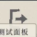 

- **用途**：纸面上的图标控件。不画底、不画框，只留实心墨色剪影——纸上贴一枚深色圆章
  会重得像块补丁。
- **出现在**：对局顶栏（离开、静音）、组牌页（静音）、教程纸面页（静音）。
- **状态**：普通 ✓ · 悬停 ✓ · 按下 ✗ · 禁用 — · 加载 —
- **尺寸和关键值**：对局顶栏 43.9×43.9、组牌 29.3×29.3、教程 34×34；
  色 `--battle-ink #30313b`（组牌是 `--ink #2e2e38`），常态 `opacity 0.72`，悬停回到 1；
  图形一律实心而不是线稿——手绘滤镜按 ±3.2px 位移，细线稿在这个尺寸上会被揉糊。
- **归属**：`canvas`。
- **旧组件**：`src/ui/MuteButton.tsx`（`variant="plain"`）、`src/ui/LeaveMatchButton.tsx`、
  `styles.css`「顶栏那一行右端的控件」一节。
- **已删（简化第 4 步之二）**：对局顶栏是这一档仅有的落地处。顶栏剥成素方块之后，
  静音那颗一起删掉（设置页里有同一个开关），「离开」换成一块 `Box`；
  占位剪影 `fx/controlIcons.ts` 和契约上的 `icons` 一起没了。

### 按钮 L（线框小钮）

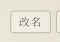 

- **用途**：纸面上的小型管理动作，一圈细线框加一行小字。
- **出现在**：组牌页（改名 / 删除 / 新建卡组）。
- **状态**：普通 ✓ · 悬停 ✓ · 按下 ✗ · 禁用 — · 加载 —
- **尺寸和关键值**：改名 / 删除 40×22.4、`padding: 3px 9px`、12.5px 字、字距 0.06em、
  色 `#6b6a5f`、底 `rgb(255 255 255 / 30%)`、`1px solid #b9b19e`、圆角 3px；
  新建那颗 22.4×24.1，同样的圆角但边框是 **虚线**（`1px dashed #b9b19e`），只画一个「+」。
- **归属**：`canvas`。
- **旧组件**：`screens/DeckScreen.tsx` 的 `.deck-manage__btn`、`.deck-tabs__new`。

### 按钮 M（实心墨块钮）

- **用途**：纸面弹窗里的主操作。整块填墨色，是全站唯一一处「不走匾额」的实心按钮。
- **出现在**：全屏提示（进入全屏）、竖屏提示（一键横屏）。两处只有触屏档出现。
- **状态**：普通 ✓ · 悬停 ✓ · 按下 ✗ · 禁用 — · 加载 —
  （旧版只写了 `:active { opacity: .82 }`，触屏没有悬停，悬停那张是脚本模拟出来的。）
- **尺寸和关键值**：`min-height: 44px`、`padding: 12px 28px`、17px 字、字距 0.25em；
  底和描边都是 `--ink #2e2e38`、字 `--paper #f0ecdf`；**没有圆角**。
- **归属**：`ui`。
- **旧组件**：`src/ui/FullscreenPrompt.tsx`、`src/ui/OrientationNotice.tsx` +
  `styles.css` 的 `.fs-prompt__go`、`.rotate-notice__rotate`。
- **已删（简化第 2 步）**：全屏入口和竖屏提示两层常驻浮层整个下线，这颗钮没有使用方了。
  `platform` 的 fullscreen / safeArea 两样能力留着——设置页那条全屏开关还在用它们。

### 按钮 N（下划线文字钮）

- **用途**：弹窗里的退让选项，做得比主操作轻两档。
- **出现在**：全屏提示（暂不，直接开始）、竖屏提示（仍要继续）。
- **状态**：普通 ✓ · 悬停 ✓ · 按下 ✗ · 禁用 — · 加载 —
- **尺寸和关键值**：`padding: 12px 16px`、字号 `--fs-lg 14px`、字距 0.1em、
  色 `--ink-2 #6b6a5f`、`text-decoration: underline`、`text-underline-offset: 4px`。
- **归属**：`ui`。
- **旧组件**：同按钮 M。
- **已删（简化第 2 步）**：同按钮 M，全屏入口和竖屏提示都下线了。

### 按钮 O（引导下一步钮）

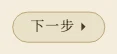

- **用途**：新手引导提示框底下那颗推进按钮，配色跟着引导的金棕系走。
- **出现在**：新手教程（引导提示框里的「下一步 ▸」）。
- **状态**：普通 ✓ · 悬停 ✓ · 按下 ✗ · 禁用 — · 加载 —
- **尺寸和关键值**：`padding: 7px 20px`、`border-radius: 999px`、`1px solid #b9a06a`、
  底 `rgb(185 160 106 / 18%)`（悬停 34%）、字 16px、字距 0.08em、色 `#4a3b22`；
  底色 180ms 过渡。
- **归属**：`canvas`（引导层压在对局画布上，见「拿不准的地方」第 2 条）。
- **旧组件**：`tutorial/TutorialOverlay.tsx` + `tutorial/tutorial.css` 的
  `.tutorial-overlay__next`。
- **已删（简化第 1 步）**：新手教程整条流程下线，这颗钮不做了。

---

## 二、边框和花饰

### 边框 A（双线雕花框）

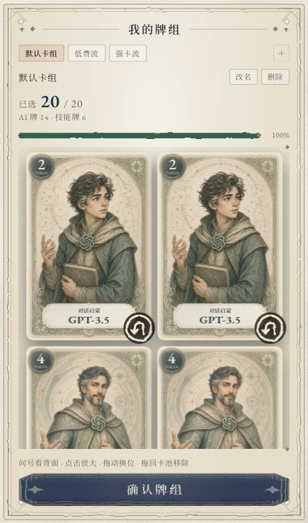

- **用途**：纸面区域共用的一圈双线，四角压一组折线装饰。内容层和装饰层分开，
  换内容不用复制装饰节点。
- **出现在**：对局（左侧栏、玩家面板）、组牌页（右侧牌组栏）、新手教程（三块纯文字纸面页）。
- **状态**：普通 ✓ · 其余 —（纯装饰，没有交互态）。
- **尺寸和关键值**：外线和内线各由四条独立的边拼成，`--of-band: 8px`；
  线色 `--battle-line #aaa391`，四角 38×38、`1px solid --battle-line-dark #777465`；
  整圈套 `#ai-duel-rough-frame` 手绘滤镜。
  **注意**：拆成四条边不是排版偏好而是性能要求——整块盒子加一圈 border 时，
  手绘滤镜按包围盒计算，组卡页实测那两条线占了整页滤镜像素的 77%。
- **归属**：**两边都要**。对局和组牌归 `canvas`，教程纸面页是纯文字页、可归 `ui`。
- **旧组件**：`src/ui/OrnateFrame.tsx` + `styles.css`「可复用纸面雕花框」一节。
- **已删（简化第 4 步之二）**：唯一的落地处是对局侧栏那两块玩家面板的外框。
  面板剥成素方块之后 `OrnateFrame` 没有调用方了，连同它那两张预烤角纹理一起删。

### 边框 B（纸面卡框）

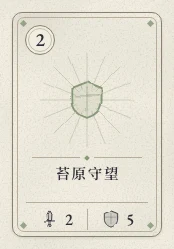

- **用途**：150×225 的纸面卡框：双线 + 四角菱形 + 费用圆 + 放射线卡面 + 名称分隔 + 攻防栏。
- **出现在**：只有设计参考页在用。正式版对应的是**卡牌**，见「九、卡牌」。
- **状态**：普通 ✓ · 选中 ✓（`--selected` 修饰类，本次未单独截）· 其余 —
- **尺寸和关键值**：150×225、圆角 10px、`1px solid #8a8270`、底 `#f0ecdf`、
  `box-shadow: 0 1px 3px rgb(80 68 44 / 16%)`；主题色由容器上的 `--accent` 驱动
  （绿 / 赭红 / 蓝 / 紫 / 黄 / 生命红六档）。
- **归属**：`canvas`。
- **旧组件**：`src/ui/paper/PaperCard.tsx` + `src/ui/paper/paper.css`。

### 边框 C（星芒细线花饰）

 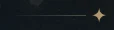

- **用途**：标题两侧那条「细线 + 星芒」的装饰，夜色页面通用。
- **出现在**：首页（标题和副标题两侧共 9 处）、选英雄页（标题两侧）、匹配房（标题两侧，
  另有两颗小星）。
- **状态**：普通 ✓ · 其余 —
- **尺寸和关键值**：首页 108×21.6（星 21.6）、英雄页 98.6×14.4、匹配房用切片素材
  158×37；色 `--home-ink #e8c69f`，星 `opacity 0.8`、线 `opacity 0.7`；
  细横线**不套**手绘滤镜——它只有 1px 高，位移量比线本身还大，会被抖成一串断点。
- **归属**：`canvas`。
- **落地（第 29-30 条）**：组件 `Flourish`，三种摆法（星在中间 / 星在右端 / 星在左端）。
  线走预烤的渐变带横向拉伸，不画 1px 实线——那条线本来就是往外淡到 0 的。
- **旧组件**：`screens/HomeScreen.tsx`、`screens/HeroScreen.tsx`、`screens/RoomScreen.tsx`
  各写一份。

### 边框 D（区块标题线）

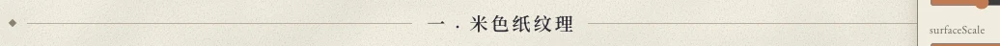 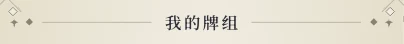

- **用途**：区块标题两侧各一段细线，线的外端点各一颗小菱形。
- **出现在**：组牌页（牌组栏标题、页头标题右侧的细线加星）、新手教程（纸面页标题）、
  对局（侧栏「卡牌详情」这类纯装饰小标题）。
- **状态**：普通 ✓ · 其余 —
- **尺寸和关键值**：19px/600 字、字距 0.16em；细线 `flex: 1` 撑开，菱形必须排在线的外侧；
  标签可换（h2 / h3 / div），装饰性小标题用 div 不进大纲。小号档字更小、字距更宽。
- **归属**：**两边都要**（组牌、对局归 `canvas`；教程纯文字页归 `ui`）。
- **旧组件**：`src/ui/paper/OrnateTitle.tsx`、`screens/DeckScreen.tsx` 的
  `.deck-side__title`、`.deck-top__rule` / `.deck-top__spark`。

### 边框 E（中线横杆）

- **用途**：战场上敌我分界的一条横线，中间嵌一枚回合徽章。
- **出现在**：对局（战场中线）。
- **状态**：普通 ✓ · 其余 —
- **尺寸和关键值**：桌面档 1085×17，两侧的线由伪元素 `flex: 1` 撑出来，徽章永远居中。
  设计参考页那条 `TurnBadge` 是同一个思路的浅纸底版本（`max-width: 320px`），两处没复用。
- **归属**：`canvas`。
- **旧组件**：`styles.css` 的 `.battle__midline`；纸面版是 `src/ui/paper/TurnBadge.tsx`。
- **已删（简化第 4 步之二）**：战场中线换成一条 1px 直线（`BoardGrid` 自己画），
  两端渐隐和 `Divider` 一起删。

### 边框 F（分隔线加宝石）

 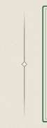

- **用途**：两块面板之间的一条横 / 竖细线，正中嵌一颗菱形宝石。
- **出现在**：对局（左侧栏上下两块玩家面板之间）、回合结算（题目区和答案区之间，竖版）。
- **状态**：普通 ✓ · 其余 —
- **尺寸和关键值**：对局那条 229×8.6（横）、结算那条 51.7×166（竖）；
  线色 `--battle-line`，宝石靠不透明底色把线从中间截断。
- **归属**：`canvas`。
- **旧组件**：`styles.css` 的 `.battle__player-divider`、`ui/RoundSettleLayer.tsx` 的
  `.settle__divider`。
- **已删（简化第 4 步之二）**：两处落地（对局侧栏的面板分隔、结算层题面和答案之间那条竖线）
  都随这两页剥成素方块没了，`Divider` 整个组件删掉。

### 边框 G（竖向分隔花饰）

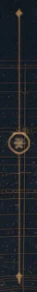

- **用途**：匹配房面板左右两栏之间的竖向装饰，整条是一张切片素材。
- **出现在**：匹配房。
- **状态**：普通 ✓ · 其余 —
- **尺寸和关键值**：25.8×280，素材 `/room/divider.webp`。
- **归属**：`canvas`。
- **旧组件**：`screens/RoomScreen.tsx` 的 `.room__divider`。

### 边框 H（页脚花饰）

- **用途**：匹配房底部的收尾装饰，一张切片素材。
- **出现在**：匹配房。
- **状态**：普通 ✓ · 其余 —
- **尺寸和关键值**：333×56，素材 `/room/foot.webp`。
- **归属**：`canvas`。
- **旧组件**：`screens/RoomScreen.tsx` 的 `.room__foot`。

---

## 三、面板和底板

### 面板 A（纸面页底）

- **用途**：整页的纸张底：纸底色 + 两层纸纹 + 暗角。是全站纸面视觉的地基。
- **出现在**：组牌页、新手教程三块纸面页、设计参考页；首页只有舞台外的留边铺纸纹。
- **状态**：普通 ✓ · 其余 —
- **尺寸和关键值**：底 `--paper #f0ecdf`，暗角
  `radial-gradient(130% 100% at 50% 42%, transparent 45%, rgb(122 106 74 / 19%) 100%)`；
  纸纹是 `.grain` 的两个绝对定位伪元素（所以宿主的伪元素不能再用作别的）。
- **归属**：**两边都要**（组牌归 `canvas`，教程文字页归 `ui`）。
- **旧组件**：`src/ui/paper/paper.css` 的 `.paper-page`、`.grain`。

### 面板 B（纸面侧栏底板）

- **用途**：纸面上再压一块更实的纸，用来分区。
- **出现在**：组牌页（右侧牌组栏）、对局（左侧栏）。
- **状态**：普通 ✓ · 其余 —
- **尺寸和关键值**：组牌 427×731、底 `#e4ddc9`、`1px solid #8a8270`、圆角 4px、
  `inset 0 0 0 1px rgb(255 255 255 / 35%)` 加一层中央提亮径向渐变；
  对局侧栏 263×748、底 `#eee9dc`、`box-shadow: 5px 0 12px rgb(14 20 35 / 16%)`。
- **归属**：`canvas`。
- **旧组件**：`screens/deck.css` 的 `.deck-side`、`styles.css` 的 `.battle__sidebar`。

### 面板 C（纸面顶栏）

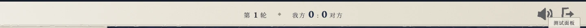

- **用途**：横贯整幅的一条纸带，放轮次比分和右端控件。
- **出现在**：对局、新手教程（同一条顶栏，右端多一颗「跳过教程」）。
- **状态**：普通 ✓ · 其余 —
- **尺寸和关键值**：桌面档高 62（令牌里是 `size.battle.topbarHeight 72px`，触屏档 56px）；
  底 `#eee9dc` 加一条横向高光渐变，`box-shadow: 0 2px 8px rgb(45 42 34 / 18%)`；
  高度写死在网格里，内容有没有都不影响下面的战场。
- **归属**：`canvas`。
- **旧组件**：`src/ui/BattleTopBar.tsx` + `styles.css`「顶栏」一节。
- **已删（简化第 4 步之二）**：对局顶栏换成一块 `Box`，`Panel` 的变体 C 删掉。

### 面板 D（夜色卡池底板）

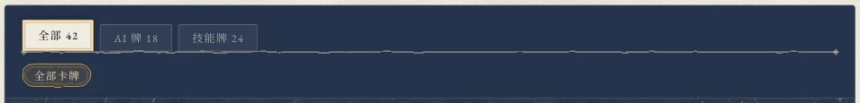

- **用途**：卡池那一大块夜色底板，底图直接用对局的战场背景。
- **出现在**：组牌页。
- **状态**：普通 ✓ · 其余 —
- **尺寸和关键值**：944×731、底 `#26334c` + `/battle/battle-bg.webp`、
  `1px solid #4a5169`、圆角 4px、`inset 0 0 0 1px rgb(255 255 255 / 6%)`；
  头部条 `.deck-pool__head` 圆角只有上面两个角。
- **归属**：`canvas`。
- **旧组件**：`screens/deck.css` 的 `.deck-pool`。

### 面板 E（Token 细条）

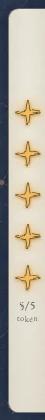

- **用途**：战场右缘吊着的一条纸质细栏，竖排 Token 余额。
- **出现在**：对局。
- **状态**：普通 ✓ · 其余 —
- **尺寸和关键值**：38×405、底和侧栏同一套纸色、`1px solid #777465`、
  圆角 `12px 0 0 12px`（只左侧圆）、`box-shadow: -5px 0 14px rgb(14 20 35 / 30%)`。
- **归属**：`canvas`。
- **旧组件**：`styles.css` 的 `.battle__token-rail`。
- **已删（简化第 4 步之二）**：细条换成「一块 `Box` 加一列小方格」（`TokenRail` 重写），
  `Panel` 的变体 E 和那颗四芒星预烤纹理删掉。位置回到黑客松版的舞台右缘。

### 面板 F（下一题纸匾）

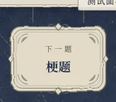

- **用途**：战场右上角吊着的一块小纸匾，写下一题的类别。整块是内联 SVG 画的：
  外轮廓、三道细边、四角卷叶、顶部冠饰、两侧铆钉。
- **出现在**：对局。
- **状态**：普通 ✓ · 其余 —（`pointer-events: none`，不是控件）。
- **尺寸和关键值**：宽 168，`viewBox 0 0 168 118`；纸色和描边同 `--battle-paper` 那套；
  上方一条吊绳（`.battle__next-plaque-cords`）。
- **归属**：`canvas`。
- **旧组件**：`ui/MatchStage.tsx` 的 `.battle__next-plaque` 一族。
- **已删（简化第 4 步之二）**：纸匾换成一块 `Box`（印「下一题 · 类别」），位置回到战场右上角。
  `Panel` 的变体 F 和它那三张预烤花纹删掉。

### 面板 G（对方回合吊匾）

- **用途**：顶栏正下方吊出来的一块深蓝小匾，写「对方回合」加三个跳动的点。
- **出现在**：对局（联机 / 教程；测试局不挂）。
- **状态**：普通 ✗ · 其余 —
  **未截到**：只在 `waitingForFoe` 期间挂出，而本地测试局里没有真对手；测试房整个不挂它。
- **尺寸和关键值**（读自 `ui/MatchStage.tsx`）：`viewBox 0 0 252 66`、圆角 8.25；
  框线单独画成 SVG 才好套手绘滤镜（CSS 的 border 直接上滤镜会把匾里的字一起抖歪）；
  常驻 DOM 靠 `data-on` 开关，隐藏态才淡得出去。
- **归属**：`canvas`。
- **旧组件**：`ui/MatchStage.tsx` 的 `.battle__turn-plaque` 一族。
- **重做（简化第 4 步之二）**：这一档从前建好了没人摆，这一步补上了——但做成素方块
  （`components/TurnPlaque.ts`：一块 `Box`，三点跳动改成文字逐帧变化，周期照旧 1.4 秒）。
  `Panel` 的变体 G 和它那两张预烤花纹删掉。

### 面板 H（羊皮纸结算底板）

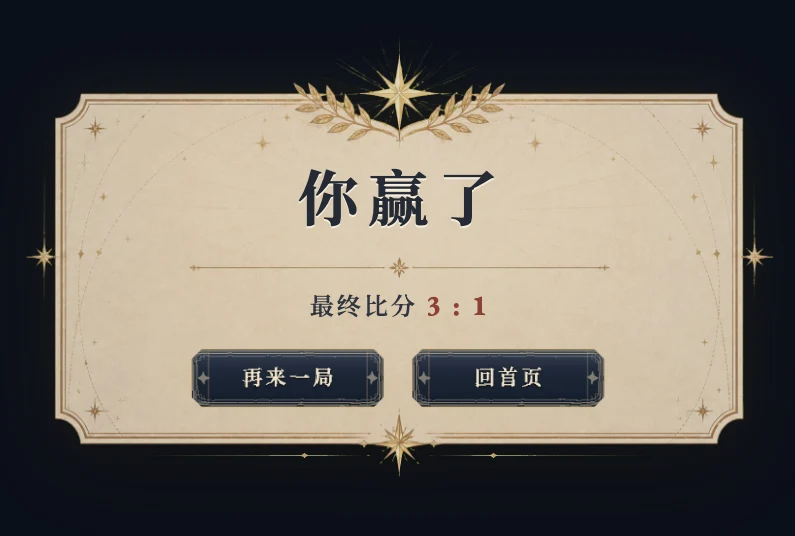

- **用途**：整局打完盖在全屏正中的那块羊皮纸，放标题、比分和一排按钮。
- **出现在**：终局结算（对局内、`/result` 调试页）。
- **状态**：普通 ✓ · 三种结果（胜 / 负 / 平）✓（`--victory` / `--defeat` / `--draw`
  修饰类，本次只截了胜局那一档）· 其余 —
- **尺寸和关键值**：775×517；标题 70px/700、字距 0.16em、色 `#252b35`；
  比分 28px/600、色 `#313640`；四角有星芒和麦穗装饰。
- **归属**：`ui`（终局结算是文字界面，见「拿不准的地方」第 1 条）。
- **落地（第 31 条）**：`ui` 的 `Sheet`。标题归它管（需求单把标题的字号、字重、字距和
  三档结果的字色都算进了这块板的关键值，交出去就会变成每个调用方各抄一遍）；
  四角的星芒和麦穗全画在底图上，组件一笔装饰都不画，底图地址由调用方给
  （`ui` 不认识素材路径）。宽度定死 775、高度靠 `aspect-ratio` 跟上，内容多一行少一行不变形。
- **旧组件**：`src/ui/MatchResult.tsx` + `styles.css` 的 `.battle__result-panel`。

### 面板 I（结算全屏纸底）

- **用途**：每轮答完盖满整块舞台的纸面底，上面再摆题目、答案和结果卡。
- **出现在**：回合结算（对局内、`/test` 调试页）。
- **状态**：普通 ✓ · 其余 —
- **尺寸和关键值**：铺满 1440×810 舞台；底 `#eee9dc` + 纸纹、`inset 0 0 0 1px #777465`。
- **归属**：`canvas`。
- **旧组件**：`src/ui/RoundSettleLayer.tsx` 的 `.settle`。
- **已删（简化第 4 步之二）**：整层的纸底换成一块 `Box`，骨架（照 1672×941 排好再整块缩放）不变。

### 面板 J（标准答案框）

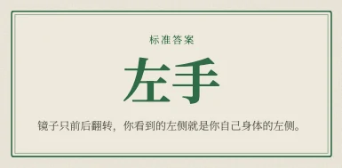

- **用途**：结算层里单独框出来的标准答案，用绿色描边和正文拉开。
- **出现在**：回合结算。
- **状态**：普通 ✓ · 其余 —
- **尺寸和关键值**：362×166、`padding: 26px 26px 28px`、`2px solid #2f6b46`、圆角 4px、
  底 `#eee9dc`；标签 13px、字距 0.16em、同色。
- **归属**：`canvas`。
- **旧组件**：`ui/RoundSettleLayer.tsx` 的 `.settle__answer-panel`。
- **已删（简化第 4 步之二）**：答案框换成一块 `Box` 加三行方块，「从左往右擦出来」那一下照旧。

### 面板 K（作答结果卡）

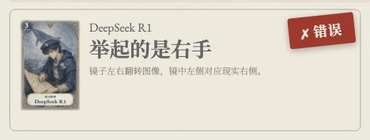

- **用途**：结算层里一张 AI 的作答：左边头像卡，右边模型名、回答和理由，判定块盖上来。
- **出现在**：回合结算。
- **状态**：普通 ✓ · 作答中（三点等待，见条 E）✗ · 其余 —
- **尺寸和关键值**：444×154、`padding: 14px`、`1px solid #aaa391`、圆角 8px、底 `#eee9dc`；
  头像 77×116；回答 30px/700；模型名 18px。
- **归属**：`canvas`。
- **旧组件**：`ui/RoundSettleLayer.tsx` 的 `.settle-card`。
- **改（简化第 4 步之二）**：底板换成 `Box`，宽度从定死的 444 改回黑客松版那套弹性的
  （每列不窄于 `size.settle.cardMinWidth` 300、列距 14，按这一侧几张分几列）。
  打字机（遮罩逐字露出）原样保留。

### 面板 L（图片底板）

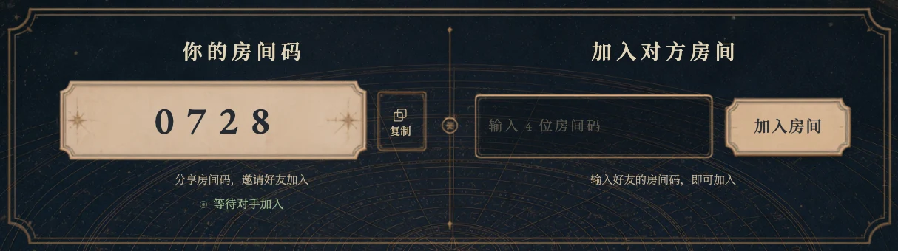 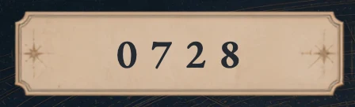

- **用途**：匹配房里靠切片素材铺出来的底板和牌子。
- **出现在**：匹配房（主面板 1199×325、房间码牌 425×112）。
- **状态**：普通 ✓ · 码没拿到时 ✗（`.room__code-pending`，脚本等到码才拍）· 其余 —
- **尺寸和关键值**：素材 `/room/panel.webp`、`/room/code-plaque.webp`；
  房间码 51.8px/600、字距 0.32em、色 `#262b33`。
- **归属**：`canvas`。
- **旧组件**：`screens/RoomScreen.tsx` 的 `.room__panel`、`.room__code`。
- **已删（简化第 4 步）**：这一档从来没落地过（房间页那一版用的是纸面面板 B）。
  现在房间页整页是素方块，`/room/panel.webp`、`/room/code-plaque.webp` 和同目录别的切片
  一起删了，这块底板不做了。

### 面板 M（技能说明卡背）

- **用途**：技能牌翻到背面时那一整页说明：眉标、卡名、菱形分隔、效果正文。
- **出现在**：组牌页（放大查看技能牌）；对局手牌翻面用的是同一套。
- **状态**：普通 ✓ · 长文案档 ✓（`data-copy-size="long"` 自动降字号，未单独截）· 其余 —
- **尺寸和关键值**：铺满一张卡（219×329 放大档）；底是米色纸面，字色照墨色那套；
  外面套一圈 `.deck-skill-back__frame` 的细线。
- **归属**：`canvas`。
- **旧组件**：`screens/DeckScreen.tsx` 的 `.deck-skill-back` 一族。

### 面板 N（英雄详情信息栏）

- **用途**：英雄放大后右侧那一栏：名字、英文名、一条渐隐横线、三段技能说明。
- **出现在**：选英雄页（详情浮层）。
- **状态**：普通 ✓ · 其余 —
- **尺寸和关键值**：432 宽；名 31.7px/600 色 `#e9dcba`；英文名 14.4px/300 色 `#c9b48c`
  `opacity 0.65`；横线是
  `linear-gradient(to right, rgb(216 201 163 / 30%), transparent)`，高 2px；
  技能名 19.4px/600 色 `#d2b47d`，正文 15.1px/300 色 `#bfae90`。
- **归属**：`canvas`。
- **旧组件**：`screens/HeroScreen.tsx` 的 `.hero__detail-info` 一族。
- **落地（第 29-30 条）**：`InfoCard` 的变体 N，和面板 O 是同一个组件（见那一条）。
  432 宽是设计值，窄屏上整块按「实际宽 ÷ 432」缩，夹在 0.7~1.15 之间。

### 面板 O（人物介绍卡）

- **用途**：首页指针停在某个人物身上时飘出来的一小块介绍。
- **出现在**：首页。
- **状态**：普通 ✗ · 其余 —
  **未截到**：命中判定靠对人物抠图的 alpha 通道做像素级 hit test，脚本要先算出人在哪儿
  才停得准，这次没做。
- **尺寸和关键值**：正文 14.7px、色 `rgb(232 198 159 / 72%)`；淡入 0.26s、淡出 0.2s、
  面板延迟 0.08s（这三个数已经在 `design` 包里，见 `duration.home.cast*`）。
- **归属**：`canvas`。
- **旧组件**：`screens/HomeScreen.tsx` 的 `.home__cast-panel-*`。
- **落地（第 29-30 条）**：和面板 N 合成一个组件 `InfoCard` 的两个变体——两者都是
  「名字 → 分隔 →（小标题 + 一段正文）×N」，只差一套字号和一条分隔线。
  **和旧版有一处不一样**：这一块背后加了一层几乎看不见的压暗（`overlay.dialog` 52%，
  不画边框也不画纸纹）。旧版那块字浮的是一片夜空，而正式版这幅画里七个人挤满整个画面，
  米色字压在人脸和衣褶上读不出来。需求单这一条当初没截到图，所以没有「旧版长什么样」可对。
- **已删（简化第 2 步）**：首页那层人物抠图和逐像素 alpha 命中整条下线，这块介绍卡跟着删，
  `InfoCard` 只剩变体 N。`color.home.cast`、`opacity.home.castCopy`、`duration.home.cast*`
  几档令牌暂时留着：淡入那一档（`castFadeIn`）变体 N 还在借用，其余等剥令牌那一步再清。

---

## 四、弹窗和浮层

### 弹窗 A（纸面对话框）

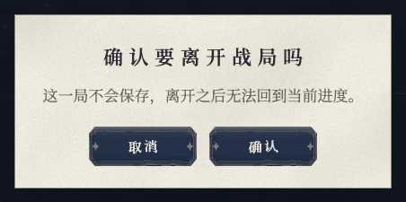 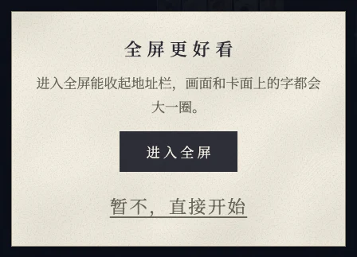 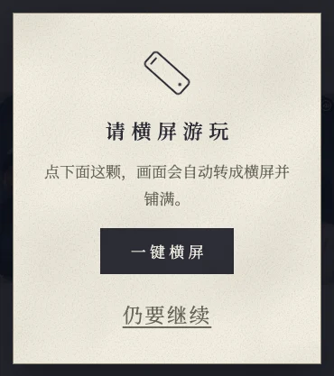

- **用途**：盖在全屏遮罩上的一张纸：标题、一段说明、一到两个操作。**三处旧代码写的是
  同一套值**，只有底部内边距差 2~4px。
- **出现在**：对局（离开确认）、进对局时的全屏提示、竖屏提示。
- **状态**：普通 ✓ · 其余 —（面板本身不是控件；里面的按钮见按钮 A / M / N）。
- **尺寸和关键值**：`width: min(420px, 100%)`、`padding: 30px 30px 22~26px`、
  `1px solid --line-dark #8a8270`、底 `--paper #f0ecdf`、
  `box-shadow: 0 18px 48px rgb(6 10 20 / 45%)`、居中对齐、纵向 gap 14~16px；
  标题 22px/600、字距 0.3em；正文 17px、行高 1.75、色 `--ink-2 #6b6a5f`；
  遮罩 `rgb(12 16 26 / 82%)`，四边按 `env(safe-area-inset-*)` 让开刘海。
  **注意**：离开确认那层必须传送到 `body`——它的触发按钮画在带 transform 的缩放层里，
  留在原地会跟着舞台一起被缩小，`position: fixed` 也会退化成相对缩放层定位。
- **归属**：`ui`。
- **旧组件**：`src/ui/LeaveMatchButton.tsx`、`src/ui/FullscreenPrompt.tsx`、
  `src/ui/OrientationNotice.tsx` + `styles.css` 的 `.leave-ask__panel`、
  `.fs-prompt__panel`、`.rotate-notice__panel`。
- **部分已删（简化第 2 步）**：全屏提示和竖屏提示两处随那两层浮层一起删了。
  弹窗 A 本身还在（`ui` 的 `Dialog`，对局离开确认那一类还在用，是全库调用方最多的一个）。

### 弹窗 B（卡牌放大浮层）

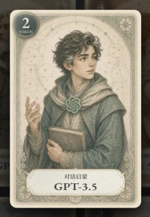 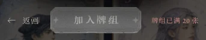

- **用途**：把一张卡放大到屏幕正中，旁边配一栏操作。点遮罩或按返回收起。
- **出现在**：组牌页（点卡放大 + 右侧操作栏）、对局（强制展示对方打出的牌）、
  新手教程（同对局那套）。
- **状态**：普通 ✓ · 悬停 ✓（操作栏里的按钮）· 其余 —
- **尺寸和关键值**：遮罩 `rgba(0 0 0 / 66%)`；放大档 `size.card.revealScale 1.7`
  （英雄 2.2、触屏 2.2 / 2.9）；进场 0.55s、退场 0.6s（已在 `design` 包的
  `duration.card.zoomIn/zoomOut`）。
- **归属**：`canvas`（浮层里就是一张卡，卡绝不进 DOM，见 2.1）。
- **旧组件**：`src/ui/CardZoomOverlay.tsx`、`screens/DeckScreen.tsx` 的 `.deck-zoom-side`。

### 弹窗 C（英雄详情浮层）

- **用途**：选英雄时点开一张，暗幕升起、卡放大到左侧、右侧摊开技能说明。
- **出现在**：选英雄页；匹配房的选英雄那一步是同一套界面。
- **状态**：普通 ✓ · 其余 —
- **尺寸和关键值**：暗幕 `rgba(5 8 12 / 82%)` 铺满 1440×900；卡 317×475、圆角 9.6、
  `box-shadow: 0 17px 37px rgb(4 8 14 / 60%)`。
- **归属**：`canvas`。
- **旧组件**：`screens/HeroScreen.tsx` 的 `.hero__detail` 一族。
- **落地（第 29-30 条）**：复用弹窗 B 那个 `RevealOverlay`（只多给它一个「卡停在横向哪一处」
  的锚点），旁边挂一块面板 N 和两颗按钮 D。**没有翻面**：英雄卡只有正面一张原画，
  说明本来就摊在旁边那一栏里，硬造一个背面等于凭空多一套要维护的美术。

### 弹窗 D（引导挖洞遮罩）

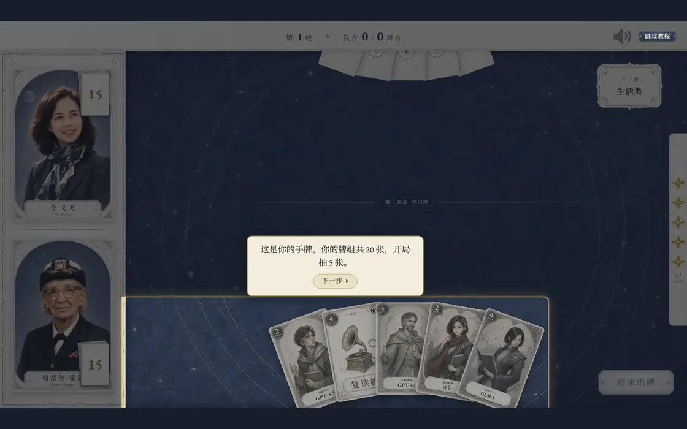 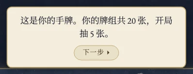

- **用途**：教学时压住整幅画面，只在要教的那件东西上挖一个洞、描一圈金色高亮，
  旁边浮一块提示。
- **出现在**：新手教程。
- **状态**：普通 ✓ · 其余 —
- **尺寸和关键值**：提示框宽 430（JS 写死）、`padding: 16px 22px`、`2px solid #b9a06a`、
  圆角 12px、底 `#f4eede`、字 21px/行高 1.5、色 `#2b2c35`、
  `box-shadow: 0 10px 26px rgb(6 10 18 / 45%)`；
  高亮环 `2px solid #f2c66b`、圆角 14px、外面两层金色辉光。
- **归属**：`canvas`（**见「拿不准的地方」第 2 条**：挖洞矩形要和画布里的对象对齐，
  按 2.4 条不能靠 DOM 和画布交换坐标）。
- **旧组件**：`tutorial/TutorialOverlay.tsx` + `tutorial/tutorial.css`。
- **已删（简化第 1 步）**：第 32 条曾用 `ui` 的 `TutorialOverlay` 实现过一版
  （挖洞矩形由场景按语义锚点回答），教程下线时连同那套锚点机制一起删了。不做了。

### 弹窗 E（结算遮罩）

- **用途**：终局结算那块羊皮纸底下的暗幕。
- **出现在**：终局结算。
- **状态**：普通 ✓（含在 `result--full-desktop` 里）· 其余 —
- **尺寸和关键值**：`rgba(8 12 20 / 78%)`，铺满舞台 1440×810。
- **归属**：`ui`（终局结算是文字界面，见「拿不准的地方」第 1 条）。
- **落地（第 31 条）**：`ui` 的 `Veil`。和弹窗 A 的遮罩**不合成一个组件**：那一层点一下就退掉
  （它挡的是一次可撤销的确认），这一层挡的是「这局已经打完了」，点哪儿都不该退，
  所以它没有 `onDismiss` 也不听 Esc。用 `position: absolute` 而不是 `fixed`，
  目录页那条条目才摆得出来。底色共用 `overlay.dialog` 那一档，不为差几个百分点的黑另开令牌。
- **旧组件**：`src/ui/MatchResult.tsx` 的 `.battle__result`。

### 弹窗 F（抛硬币过场）

- **用途**：开局定先手的一段过场：一枚硬币翻转，底下一行字。
- **出现在**：对局、新手教程。
- **状态**：普通 ✗ · 其余 —
  **未截到**：它是开局那几秒的过场，脚本恰恰要等它演完（`waitForSelector` 的 `detached`）
  才开始拍。要单独拍得给取景表加一幕、在硬币出现的瞬间停住。
- **归属**：`canvas`。
- **旧组件**：`ui/MatchStage.tsx` 的 `.coin-toss` 一族。
- **已删（简化第 4 步之二）**：币面换成两块印着「正」「反」的 `Box`，预烤的盘面和外圈删掉。
  压暗层、翻转（`scale.x = |cos θ|`）和全部时长一个数没动。技能抵消层同样只换画面。

### 弹窗 G（选目标层）

- **用途**：打技能牌 / 发动英雄技能后进入的选目标态：全场压暗、可选目标描边、
  顶部一行提示、一颗取消。
- **出现在**：对局。
- **状态**：普通 ✗ · 其余 —
  **未截到**：要先打出一张带目标的技能牌，本次取景没走到这一步。
- **归属**：`canvas`。
- **旧组件**：`ui/MatchStage.tsx` 的 `.battle__targeting`、`.skill-cancel` 一族。

---
- **部分已删（简化第 4 步之二）**：顶边那条提示药丸换成 `Box`，格子外那圈呼吸描边换成 `Box`。
  压暗那一层留着——它不是界面件，是这一步能不能读懂的前提。

## 五、徽章和圆章

### 徽章 A（费用圆章）

 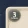

- **用途**：卡面左上角那枚「N TOKEN」圆章。两类牌都用它，但盖的东西不一样：
  AI 牌盖原画角上的星章，技能牌盖原画里已经烘死的那枚同位置圆章
  （烘死的那枚一改数值就对不上，宁可原样再画一遍盖住）。
- **出现在**：对局（手牌、战场小卡、英雄牌）、组牌页（卡池卡、迷你卡、放大卡）、
  首页（展示卡）、回合结算（结果卡头像）。
- **状态**：普通 ✓ · 其余 —（`pointer-events` 不吃，纯显示）。
- **尺寸和关键值**：正圆，直径全场统一写在 `cardFaceOverlay.css`（放大档 43.7）；
  盘底色可传（技能牌传的是从原画那枚圆章上采下来的色）；三道同心细边 + 上下两段弧线；
  数字 60px（两位数降到 48），单位 TOKEN 一行小字；
  `box-shadow: 0 1px 3px rgb(43 34 21 / 40%)`。
- **归属**：`canvas`。
- **旧组件**：`src/ui/CardCostBadge.tsx` + `src/ui/cardFaceOverlay.css`。

### 徽章 B（问号帮助圆章）

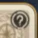

- **用途**：卡牌右上角那枚「这张牌能翻面」的提示章。只管样子，翻面交互归各页自己的热区。
- **出现在**：对局（手牌）、组牌页（卡池卡和迷你卡）。
- **状态**：普通 ✓ · 其余 —（`pointer-events: none`）。
- **尺寸和关键值**：三处都是 22px（同一块 1672×941 舞台，同数值就是同大小），
  长相和按钮 J 的夜色圆章完全一致：底 `rgb(20 17 12 / 78%)`、线条 `#f3ead6`；
  外圈不用 CSS 的 border——border 抖不起来，会和圈里的问号对不上。
  **三处都常驻显示**：问号是「能翻面」唯一的提示，藏到悬停之后等于没有。
- **归属**：`canvas`。
- **旧组件**：`src/ui/CardHelpMark.tsx`。

### 徽章 C（卡面铭牌）

- **用途**：卡面下部那块带卷叶花饰的铭牌，上行技能名、下行模型名。整块是内联 SVG，
  和插画分离，所以缩成手牌时字还认得出。
- **出现在**：对局（手牌、战场小卡、英雄牌）、组牌页、首页展示卡、回合结算头像卡。
- **状态**：普通 ✓ · 其余 —
- **尺寸和关键值**：`viewBox 0 0 760 230`；三道描边（3 / 2 / 1.5）加四角卷叶和上下菱形；
  技能名 40px/600，模型名 76px/600，两行都用 `textLength` + `lengthAdjust` 压进铭牌，
  不靠测量 DOM（手牌动画期间不能重排版）。
- **归属**：`canvas`。
- **旧组件**：`src/ui/CardFaceOverlay.tsx` + `src/ui/cardFaceOverlay.css`。

### 徽章 D（卡角状态角标）

- **用途**：小卡角上一列药丸状小标，说明这张牌现在被什么影响着。
- **出现在**：对局（复读中 / 已颠倒 / 已净化 / 保送 / 已进化 / 金钟罩 / 已升级 / 已降级 /
  技能已用）。
- **状态**：普通 ✗ · 其余 —
  **未截到**：每一枚都要先打出对应的技能牌或发动英雄技能才出现，本次取景没走到。
- **尺寸和关键值**（读自 `styles.css`）：`padding: 2px 7px`、`border-radius: 999px`、
  底 `rgb(12 18 30 / 88%)`、默认描边 `rgb(255 196 96 / 60%)`（干扰的琥珀档），
  另有 `--safe` / `--up` / `--down` 三个修饰色；从小卡左上角往下排、间距 3px、
  最多五枚约 85px 高。
  英雄牌上的两枚不走这套：`技能已用` 在左上、`padding: 2px 6px`、
  `border-radius: 6px 0 6px 0`、底是墨蓝 82% 混色；`金钟罩` 在右上、镜像圆角、
  底 `#123049` 86%、描边和字是浅蓝 `#bfe6ff`。
- **归属**：`canvas`。
- **旧组件**：`styles.css` 的 `.battle__tile-mark`、`.battle__hero-used`、
  `.battle__shield-mark`。
- **已删（简化第 4 步之二）**：战场小卡上那几枚换成 `Box`，四档配色一起没了
  （`TileMark` 只剩文案）。`Badge` 本身还在——组牌页和选英雄页还在用。

### 徽章 E（中线回合徽章）

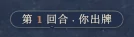

- **用途**：嵌在战场中线正中的一枚深蓝小牌，写第几回合、轮到谁。
- **出现在**：对局。
- **状态**：普通 ✓ · 其余 —
- **尺寸和关键值**：126×17、`padding: 0 12px`、圆角 10px、底 `#232f48`、
  `1px solid rgb(214 204 178 / 38%)`、字 12px 字距 0.1em 色 `rgb(228 218 192 / 88%)`、
  `box-shadow: 0 1px 4px rgb(6 12 24 / 45%)`。
- **归属**：`canvas`。
- **旧组件**：`styles.css` 的 `.battle__midline-badge`。
- **已删（简化第 4 步之二）**：换成一块 140×20 的 `Box`。

### 徽章 F（轮次药丸）

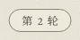

- **用途**：结算层左上角标本轮是第几轮。
- **出现在**：回合结算。
- **状态**：普通 ✓ · 其余 —
- **尺寸和关键值**：69×26、`padding: 4px 14px`、`border-radius: 999px`、底 `#eee9dc`、
  `1px solid #777465`、字 14px 字距 0.12em 色 `#6d6b61`。
- **归属**：`canvas`。
- **旧组件**：`ui/RoundSettleLayer.tsx` 的 `.settle__round-pill`。
- **已删（简化第 4 步之二）**：结算层顶栏那颗换成 `Box`。

### 徽章 G（领先徽章）

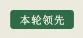

- **用途**：结算层里标出本轮领先的一方，绿底白字。
- **出现在**：回合结算。
- **状态**：普通 ✓（截到的是入场前 `opacity: 0` 那一帧的版式）· 其余 —
- **尺寸和关键值**：45×13、`padding: 2px 10px`、圆角 4px、底 `#2f6b46`、字 12px
  字距 0.1em 色 `#eee9dc`。
- **归属**：`canvas`。
- **旧组件**：`ui/RoundSettleLayer.tsx` 的 `.settle__lead-badge`。
- **已删（简化第 4 步之二）**：换成标头里的一格 `Box`。

### 徽章 H（对错判定块）

- **用途**：结果卡上盖下来的「✓ 正确 / ✗ 错误」大印。
- **出现在**：回合结算。
- **状态**：普通 ✓ · 其余 —
- **尺寸和关键值**：172×110、`padding: 8px 18px`、圆角 4px、错误底 `#9e3a2e`、
  字 20px/700 字距 0.06em 色 `#eee9dc`、`box-shadow: 0 3px 10px rgb(0 0 0 / 30%)`；
  正确那一档是绿底（`#2f6b46` 系），本次场景没抽到。
- **归属**：`canvas`。
- **旧组件**：`ui/RoundSettleLayer.tsx` 的 `.settle-card__verdict`。
- **已删（简化第 4 步之二）**：换成一块 96×36 的 `Box`，歪 6° 和「从大缩到原大」那一下照旧。

### 徽章 I（敬请期待角标）

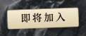

- **用途**：还没做完的英雄卡上压一块米色小牌。
- **出现在**：选英雄页。
- **状态**：普通 ✓ · 其余 —
- **尺寸和关键值**：103×31、`padding: 6px 16px`、圆角 3.6、
  底 `linear-gradient(#f4ead3, #ddcaac)`、`1px solid rgb(58 46 32 / 45%)`、
  字 13.7px/600 字距 0.2em 色 `#2b2119`、`box-shadow: 0 3.6px 8.6px rgb(4 8 14 / 45%)`。
- **归属**：`canvas`。
- **旧组件**：`screens/hero.css` 的 `.hero__card-soon`。
- **落地（第 29-30 条）**：`Badge` 的变体 I。**不走药丸那条九宫格**：它的圆角只有 3.6px，
  用药丸画出来是一颗胶囊。底色取渐变起点那一档实色（103×31 上肉眼看不出渐变）。

### 徽章 J（拱窗名牌）

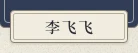

- **用途**：从拱窗头像框底下探出来的一块纸白名牌。
- **出现在**：只有设计参考页在用（旧版没有别处用到）。
- **状态**：普通 ✓ · 其余 —
- **尺寸和关键值**：118×33、`padding: 5px 0`、圆角 4px、底 `#f0ecdf`、
  `1px solid #8a8270`、字 15px/600 字距 0.1em；靠负 margin 压在框底、
  用 z-index 盖住拱窗边框（所以头像框要 `overflow: hidden` 而名牌在它外面）。
- **归属**：`canvas`。
- **旧组件**：`src/ui/paper/PortraitFrame.tsx`。

### 徽章 K（回合小匾）

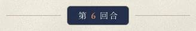

- **用途**：横贯细线中间嵌的一块深蓝小匾，写第几回合。
- **出现在**：只有设计参考页在用。对局那条中线是同一个思路的另一套配色（见徽章 E）。
- **状态**：普通 ✓ · 其余 —
- **尺寸和关键值**：104×33、`padding: 5px 16px`、圆角 6px、底 `#232f4b`、
  `1px solid #8a8270`、字 14px 字距 0.14em 色 `#f0ecdf`。
- **归属**：`canvas`。
- **旧组件**：`src/ui/paper/TurnBadge.tsx`。

### 徽章 L（状态圆点）

- **用途**：状态文字前面那颗表示「连着 / 断了 / 在等」的小圆点。
- **出现在**：匹配房（连接状态、等待对方进房那一屏）。
- **状态**：普通 ✓ · 各状态色 ✗（只截到已连接那一档）· 其余 —
- **尺寸和关键值**：9.4×9.4、`border-radius: 50%`、`1px solid currentColor`、
  `opacity 0.59`，颜色跟着状态修饰类走（已连接绿 `#97b487`）。
- **归属**：`canvas`。
- **旧组件**：`screens/RoomScreen.tsx` 的 `.room__dot`、`.room-waiting__dot`。

### 徽章 M（数据标签）

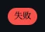

- **用途**：数据表格里标一格的性质：拒答、缺失。
- **出现在**：预生成对照页。
- **状态**：普通 ✓ · 缺失 / 拒答两档 ✗（数据里没抽到）· 其余 —
- **尺寸和关键值**：38×22、`padding: 1px 8px`、`border-radius: 999px`、底 `#f85149`、
  字 11px 色 `#0d1117`。
- **归属**：`ui`。
- **旧组件**：`screens/generation.css` 的 `.generation__badge`。

---

## 六、条（法力、进度、加载）

### 条 A（牌组进度条）

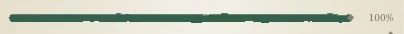

- **用途**：牌组选了几张 / 共几张，数字加一条细进度。
- **出现在**：组牌页。
- **状态**：普通 ✓ · 未满 / 满两档 ✗（截到的是满的那一档）· 其余 —
- **尺寸和关键值**：轨 343×10.3、填充高 7.8、圆角 5px、填充色 `#35604d`（满档）。
- **归属**：`canvas`。
- **旧组件**：`screens/DeckScreen.tsx` 的 `.deck-progress`。

### 条 B（素材加载进度条）

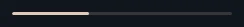

- **用途**：加载页上那条素材下载进度。
- **出现在**：首页、匹配房、选英雄、组牌、对局、教程、信息页的加载态（每页进来都先过它）。
- **状态**：普通 ✓ · 0 / 100 两端 ✗ · 其余 —
- **尺寸和关键值**：`width: 220px; max-width: 60vw`、高 3px、`border-radius: 999px`、
  轨 `rgb(221 202 183 / 18%)`、填充 `#ddcab7`、`transition: width 240ms ease-out`
  （只往变宽一个方向走，进度不回退）。
- **归属**：`ui`（加载页是 React 层的事，画布还没起来）。
- **落地（第 31 条）**：`ui` 的 `ProgressBar`。百分数只取整不四舍五入（99.6% 显示成 100%
  而画面没换，看着像卡住了），NaN 和越界一律夹回来——不夹的话宽度会变成 `NaN%`，
  CSS 直接忽略，同样看着像卡在原地。
- **旧组件**：`src/ui/LoadingScreen.tsx` + `styles.css` 的 `.page-loader__bar`。
- **已删（简化第 2 步）**：加载页换成一行「加载中 37%」纯文字，`ui` 的 `ProgressBar`
  连组件、样式、目录页条目和两个平台的基线一起删。百分数那条「只取整不四舍五入」的规矩
  搬进了 `client` 的 `LoadingScreen.tsx`。

### 条 C（法力计）

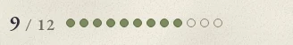

- **用途**：衬线数字加一排点，点的总数是上限、点亮的是当前值。
- **出现在**：只有设计参考页在用。对局里的 Token 余额用的是另一套（面板 E 里的竖排数字）。
- **状态**：普通 ✓ · 其余 —
- **尺寸和关键值**：单点 10×10、`border-radius: 50%`、亮 `#7d8a5f` / `1px solid #5f6a45`；
  数字和点都画一遍是故意的：点适合一眼看出还剩几格，具体数值还是数字快。
- **归属**：`canvas`。
- **旧组件**：`src/ui/paper/ManaMeter.tsx`。

### 条 D（卡牌加载动画）

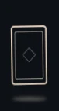

- **用途**：一张线框卡立在地上左右晃，全站的「正在加载」。
- **出现在**：同条 B（两者一起出现在加载页上）。另有 `index.html` 里一份纯 CSS 拷贝，
  用在 bundle 还没下完的首屏。
- **状态**：普通 ✓ · 其余 —
- **尺寸和关键值**：`--cl-size: 72px`（卡宽是它的 2/3）、`--cl-speed: 1.75s`
  （已在 `design` 包的 `duration.card.loaderCycle`）、`--cl-color: #ddcab7`
  （已在 `color.card.loaderLine`）、描边 `clamp(1.5px, size/36, 3px)`、
  圆角 `size * 0.06`；`transform-origin: 50% 100%`，看着是卡立在地上晃不是悬空自转。
- **归属**：`ui`。
- **落地（第 31 条）**：`ui` 的 `CardLoader`。颜色那个旋钮去掉了（线框色已经收进令牌，
  留一个能改成任意颜色的 prop 会让「设计令牌只定义一次」名存实亡），只剩 size / speed 两个。
  减少动效下整段弹跳换成明暗呼吸，同时认系统的 `prefers-reduced-motion` 和玩家在设置页点的那一档。
- **旧组件**：`src/ui/CardLoader.tsx` + `styles.css` 的 `.card-loader`。
- **已删（简化第 2 步）**：同条 B，加载页只剩一行字，`ui` 的 `CardLoader` 一起删。
  顺带没了「减少动效」在 React 这一侧的唯一两处落点，原委见 `client` 的 app/reducedMotion.ts。

### 条 E（三点等待动画）

- **用途**：结果卡在「AI 还在作答」时先摆三个跳动的点。
- **出现在**：回合结算。
- **状态**：普通 ✗ · 其余 —
  **未截到**：结果一到就淡出，脚本等的是主线演完之后那一帧，那时它已经 `opacity: 0`。
- **归属**：`canvas`。
- **旧组件**：`ui/RoundSettleLayer.tsx` 的 `.settle-card__loader`。

---

## 七、标签页

### 标签页 A（药丸卡组页签）

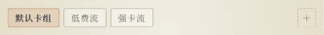

- **用途**：在多套牌组之间切换，最后跟一颗虚线「+」新建。
- **出现在**：组牌页。
- **状态**：普通 ✓ · 悬停 ✓ · 选中 ✓（截图里第一颗就是选中态）· 按下 ✗ · 禁用 —
- **尺寸和关键值**：单项 65×24、`padding: 4px 10px`、圆角 3px、12.5px/600 字、字距 0.06em；
  选中底 `rgb(192 122 82 / 16%)`、`1px solid rgb(192 122 82 / 62%)`；
  新建那颗见按钮 L。
- **归属**：`canvas`。
- **旧组件**：`screens/DeckScreen.tsx` 的 `.deck-tabs`、`.deck-tab`。

### 标签页 B（纸页签）

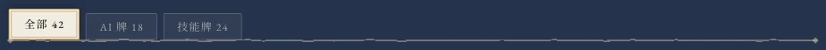 

- **用途**：像文件夹标签那样从纸面上翘起来的一排页签。
- **出现在**：组牌页（全部 / AI 牌 / 技能牌）；设计参考页那套 `PaperTabs` 是另一副长相
  （当前项下方一条赭红短横线，两端各一颗小菱形）。
- **状态**：普通 ✓ · 悬停 ✓ · 选中 ✓ · 按下 ✗ · 禁用 —
- **尺寸和关键值**：组牌那套单项 79×35、`padding: 9px 18px 10px`、
  `border-radius: 2px 2px 0 0`、`1px solid #d9a441`、底 `#f0ecdf`、14px/600 字、
  字距 0.1em、`box-shadow: 0 -2px 8px rgb(0 0 0 / 26%)`（阴影朝上，才像从纸里翘起来）；
  `PaperTabs` 单项 43×35、17px/600 字、字距 0.18em、下边距 10px。
- **归属**：`canvas`。
- **旧组件**：`screens/DeckScreen.tsx` 的 `.deck-kinds` / `.deck-kind`、
  `src/ui/paper/PaperTabs.tsx`。

### 标签页 C（描边胶囊筛选）

- **用途**：夜色底板上按阵营筛选，一排描边胶囊。
- **出现在**：组牌页（卡池头部）。
- **状态**：普通 ✓ · 悬停 ✓ · 选中 ✓ · 按下 ✗ · 禁用 —
- **尺寸和关键值**：单项 76×26、`padding: 5px 14px`、13.5px 字、字距 0.1em、
  色 `#f3e2b8`；选中项加一圈浅金描边胶囊。
- **归属**：`canvas`。
- **旧组件**：`screens/DeckScreen.tsx` 的 `.deck-factions`、`.deck-faction`。

### 标签页 D（阵营侧条）

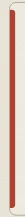

- **用途**：结算层里贴在结果卡纵列外侧的一条竖色带，分我方 / 对方。
- **出现在**：回合结算。
- **状态**：普通 ✓ · 其余 —
- **尺寸和关键值**：5.2×197、`border-radius: 0 4px 4px 0`、我方 `#b23f33`
  （已在 `color.theme.life`）。
- **归属**：`canvas`。
- **旧组件**：`ui/RoundSettleLayer.tsx` 的 `.settle__squad-tab`。

---
- **已删（简化第 4 步之二）**：结算层两侧标头那条竖色带没了，标头改成三格 `Box`。

## 八、列表和表格

### 列表 A（卡槽网格）

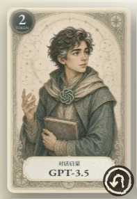

- **用途**：定宽的卡位网格，空位画一个虚线卡槽。
- **出现在**：组牌页（右侧 20 个卡位）、对局（战场两排落点）。
- **状态**：普通 ✓ · 空槽 ✓（见 `design__paper-slot`，本次存档是满的所以组牌页拍不到）·
  拖拽悬停 ✗ · 其余 —
- **尺寸和关键值**：组牌单格 177×266，网格上下内边距 8 / 10；
  空槽是同一套 DOM 换掉配色：底 `rgba(35 47 75 / 7%)`、`1px dashed #b9b19e`、
  罗盘不透明度从 0.62 降到 0.28。
- **归属**：`canvas`。
- **旧组件**：`screens/DeckScreen.tsx` 的 `.deck-slots`、`src/ui/paper/PaperCardBack.tsx`。

### 列表 B（结果卡纵列）

- **用途**：结算层里我方 / 对方各一列结果卡，列数跟着上场张数变。
- **出现在**：回合结算。
- **状态**：普通 ✓ · 单边空场 ✗ · 其余 —
- **尺寸和关键值**：单卡见面板 K；两列之间靠 `.settle__squad-sep` 分隔，
  外侧各贴一条阵营侧条。
- **归属**：`canvas`。
- **旧组件**：`ui/RoundSettleLayer.tsx` 的 `.settle__squads`。

### 列表 C（步骤条）

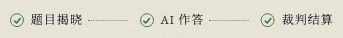

- **用途**：结算层顶部的三步进度：题目揭晓 → AI 作答 → 裁判结算。
- **出现在**：回合结算。
- **状态**：普通 ✓ · 已完成 / 进行中两档 ✗（截到的是全部完成那一帧）· 其余 —
- **尺寸和关键值**：单步 73×19、标记 13.8×13.8、`border-radius: 50%`、
  `1px solid #2f6b46`，中间是一个内联 SVG 的勾。
- **归属**：`canvas`。
- **旧组件**：`ui/RoundSettleLayer.tsx` 的 `.settle__steps`、`.settle__step-mark`。
- **已删（简化第 4 步之二）**：三步换成三格 `Box`，还没走到的那几格压暗——
  素方块只有「实」和「暗」两档，分辨力从三档掉到两档。

### 列表 D（信息页文字行）

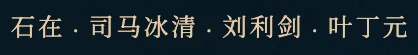

- **用途**：一行一条的纯文字条目，字距拉得很开，居中排。
- **出现在**：信息页。
- **状态**：普通 ✓ · 其余 —
- **尺寸和关键值**：24.5px 字、字距 0.12em、色 `#e8c69f`；标题行 38.9px/500 色 `#fbe6c4`。
- **归属**：`ui`。
- **旧组件**：`screens/InfoScreen.tsx` + `screens/info.css`。

### 列表 E（数据对照表）

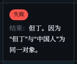 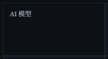

- **用途**：行是模型、列是题目的对照表，格子里放回答和判定。整页是系统风，不套纸面视觉。
- **出现在**：预生成对照页。
- **状态**：普通 ✓ · 悬停 ✗ · 其余 —
- **尺寸和关键值**：格 144×118、`padding: 10px 12px`、底 `#0d1117`、`1px solid #21262d`；
  行头 200 宽、底 `#11161d`、700 字重；角格 13px/600 色 `#8b949e`。
- **归属**：`ui`。
- **旧组件**：`screens/GenerationScreen.tsx` + `screens/generation.css`。

---

## 九、提示和横幅

### 提示 A（面板内嵌提示条）

- **用途**：贴在面板底边的一条说明，讲这块区域怎么用。
- **出现在**：组牌页（卡池底边、牌组栏底边）。
- **状态**：普通 ✓ · 其余 —
- **尺寸和关键值**：942×39、`padding: 12px 22px 14px`、底 `#323d57`、
  `1px solid rgb(226 214 186 / 26%)`、`border-radius: 0 0 3px 3px`、
  12.5px 字、字距 0.06em、色 `rgb(239 233 216 / 62%)`。
- **归属**：`canvas`。
- **旧组件**：`screens/deck.css` 的 `.deck-pool__hint`、`.deck-side__hint`。

### 提示 B（浮起小气泡）

- **用途**：贴着某个元件浮出来的一句话，默认 `opacity: 0`，满足条件才淡入。
- **出现在**：选英雄页（卡片上的提示）、组牌页（加牌提示）、对局（手牌锁住时的原因）。
- **状态**：普通 ✓（截到的是 `opacity: 0` 那一帧的版式）· 浮出 ✗ · 其余 —
- **尺寸和关键值**：英雄页 108×24.5、`padding: 5px 13px`、圆角 13px、
  底 `rgba(10 14 20 / 72%)`、`1px solid rgb(210 180 125 / 45%)`、12.4px 字、
  字距 0.08em、色 `#f2e5c2`；
  组牌页那颗 `border-radius: 999px`、底 `rgba(14 21 36 / 92%)`、
  描边 `rgb(255 229 164 / 55%)`、字 `#ffeec5`、`box-shadow: 0 4px 14px rgb(4 9 19 / 45%)`。
- **归属**：`canvas`。
- **旧组件**：`screens/hero.css` 的 `.hero__card-hint`、`screens/deck.css` 的
  `.deck-add-tip`、`styles.css` 的 `.hand-fan__lock-tip`。

### 提示 C（喊话气泡）

- **用途**：「催一催」喊出去之后弹的字幕气泡，右下角带一条指向按钮的小尾巴。
- **出现在**：对局。
- **状态**：普通 ✗ · 其余 —
  **未截到**：和按钮 C 同一个前提，要真有个对手在等。
- **尺寸和关键值**（读自 `styles.css`）：小尾巴是两层三角（外层深一档当描边、
  内层填纸色）；整块 `pointer-events: none`，位置卡在右下角一小块空地里，不遮任何按钮。
- **归属**：`canvas`。
- **旧组件**：`styles.css` 的 `.battle__urge-bubble`。
- **已删（简化第 2 步）**：「催一催」整条链下线，`Bubble` 的变体 C（纸色底加一条小尾巴那一档）
  连目录页条目和基线一起删，这个组件只剩提示 B 和提示 E 两档。

### 提示 D（带圆点状态行）

- **用途**：一颗状态圆点加一行字，说明连接现在处于什么状态。
- **出现在**：匹配房。
- **状态**：普通 ✓ · 断开 / 等待两档 ✗ · 其余 —
- **尺寸和关键值**：15.8px 字，颜色跟着状态走（已连接 `#97b487`）；圆点见徽章 L。
- **归属**：`canvas`。
- **旧组件**：`screens/RoomScreen.tsx` 的 `.room__status`。

### 提示 E（错误红字）

- **用途**：一行红字说明刚才那步为什么没成。
- **出现在**：匹配房（加入失败、连接失败、对方离开）、组牌页（还需选择 N 张）、
  对局（出牌被拒的原因）。
- **状态**：普通 ✗ · 其余 —
  **未截到**：三处都要先制造一次失败。版式在 `room__hint` 那张里能看到同一行的位置。
- **尺寸和关键值**：匹配房 15.1px 字、色 `#c9847a`；组牌页那句「还需选择 N 张」
  跟着牌组栏底部的字号走；对局那条是 `.battle__reject`。
- **归属**：**两边都要**（匹配房 / 组牌 / 对局归 `canvas`；正式版的表单校验提示归 `ui`）。
- **落地（第 31 条，`ui` 这一半）**：`Notice`，三档语气共用一套版式（错误红 / 成功绿 /
  次级墨色）。后两档需求单没列，是做出设置页和账号页之后才需要的——「重置完成」和
  「这一项暂时没有」显然不是错误。错误那档用 `role="alert"`（当场念出来），其余两档用 `status`。
- **旧组件**：`screens/RoomScreen.tsx` 的 `.room__error`、`.room__connect-error`、
  `.room__notice`；`screens/DeckScreen.tsx` 的 `.deck-shortfall`；
  `styles.css` 的 `.battle__reject`。
- **已删（简化第 4 步之二）**：对局页那条换成一块 `Box`，淡入淡出照旧。
  `Bubble` 本身还在——选英雄页的 hover 提示（提示 B）用的是同一个组件。

### 提示 F（等待页）

- **用途**：联机客人还没收到开局数据时的整屏等待：一行字加一颗跳动的点。
- **出现在**：匹配房 / 对局之间的过渡。
- **状态**：普通 ✗ · 其余 —
  **未截到**：要真凑两个客户端才走得到。
- **归属**：`canvas`。
- **旧组件**：`screens/RoomScreen.tsx` 的 `.room-waiting`。

---

## 十、图标

### 图标 A（纸面手绘图标集）

- **用途**：剑、盾、心、法力这一套纸面风格的手绘图标。描边取 `currentColor`，
  换色只要改容器的 color。
- **出现在**：设计参考页、组牌页（纸面组件里）、新手教程纸面页。
- **状态**：普通 ✓ · 其余 —
- **尺寸和关键值**：一份 `<symbol>` 定义 + 一个引用它们的组件；每个图标叠第二条略微偏移、
  更细更淡的描边模拟重描，填色是 `currentColor` 加 12%~28% 透明度做「水彩没涂满」；
  真正的歪扭来自 `rough` 属性挂上去的位移滤镜，同屏相邻的图标要用不同的 rough 编号，
  否则会歪成同一条线。
- **归属**：**两边都要**。
- **旧组件**：`src/ui/paper/PaperIcons.tsx`。

### 图标 B（控件线稿图标）

 

- **用途**：控件上的功能图标：返回箭头、喇叭（有声 / 静音）、离开的门、问号、复制、
  旋转手机、书本。
- **出现在**：全部七个正式界面。
- **状态**：普通 ✓ · 悬停 ✓ · 其余 —
- **尺寸和关键值**：一律内联 SVG，不用字体里的符号——整套界面的线条都挂着手绘位移滤镜，
  字符画出来的是字体轮廓，位移作用在它上面会糊成一团；同理外圈不用 CSS 的 border。
  小尺寸上要画实心剪影而不是线稿（滤镜按 ±3.2px 位移，细线会被揉糊）。
- **归属**：**两边都要**。
- **落地（第 31 条，`ui` 这一半）**：`Icon`，九个名字（返回、有声 / 静音、全屏、分享、
  转屏、问号、星芒、菱形）。描边取 `currentColor`、粗细用 viewBox 单位所以跟着尺寸缩。
  「离开的门」「复制」「书本」还在 `canvas` 那一半，那三处都在画布上，用到时再往这边补。
- **旧组件**：`BackButton`、`MuteButton`、`LeaveMatchButton`、`CardHelpMark`、
  `OrientationNotice`、`RoomScreen` 各自内联。

### 图标 C（星芒与菱形）

- **用途**：纯装饰的小星芒和小菱形，用来当分隔、端点、点缀。
- **出现在**：首页（导航分隔星、花饰星）、对局（顶栏菱形、中线宝石）、组牌页
  （页头星芒、页签菱形）、匹配房（副标题两侧小星）、设计参考页（标题两端菱形）。
- **状态**：普通 ✓ · 其余 —
- **尺寸和关键值**：星芒 9.5~21.6，菱形 9.5~12；色跟着上下文，常带 0.7~0.8 的不透明度。
- **归属**：**两边都要**。
- **落地（第 31 条，`ui` 这一半）**：并进 `Icon` 的 `star` / `diamond` 两个名字，
  实心不描边——它们只有 9~21px，描边会把内部空间挤没。
- **旧组件**：散落在 `HomeScreen`、`DeckScreen`、`BattleTopBar`、`OrnateTitle`、
  `PaperCard` 各处，没有公共实现。

---

## 十一、卡牌

### 卡牌 A（卡面 · 牌背 · 扇形）

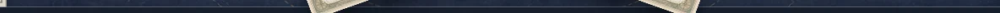

- **用途**：卡面、牌背、手牌扇形、拖出出牌、翻面、命中特效。
- **出现在**：首页（展示卡）、对局（手牌、战场小卡、英雄牌、对手倒扇形）、组牌页
  （卡池卡、迷你卡、放大卡）、选英雄页、回合结算（头像卡）。
- **状态**：见 `packages/canvas`——**这一类不在本需求单的盘点范围内**，
  第 8 章第 1 条已经用 Pixi 做了第一批组件。
- **归属**：`canvas`。
- **旧组件**：`src/ui/HandFan.tsx`、`src/ui/OpponentFan.tsx`、
  `src/ui/CardFaceOverlay.tsx`、`src/ui/paper/PaperCard.tsx`。
- **本单里和卡牌相关的小件**（按需求第 4 条单独盘进徽章类）：徽章 A 费用圆章、
  徽章 B 问号帮助圆章、徽章 C 卡面铭牌、徽章 D 卡角状态角标（含进化 / 升降级那几枚）。

---

## 拿不准的地方

归属规则是「首页、对局、牌组、英雄页、开包、房间页归 `canvas`，信息页、生成页、设置、
账号、弹窗、列表归 `ui`」。下面四处两条规则打架，先按这里的判断填了归属，等做到对应
迁移条目时再定。

1. **终局结算和回合结算算「对局」还是「弹窗」**（面板 H、面板 I、弹窗 E）。
   两层都是纯文字纸面、没有卡牌，按「弹窗归 ui」应当进 `ui`；但它们铺满的是对局那块
   16:9 舞台、和对局共用同一套缩放和纸色变量，按「对局归 canvas」应当进 `canvas`。
   **已定**：两层分开归。回合结算（面板 I、面板 J、面板 K）归 `canvas`——它摆着
   AI 头像卡，卡不能进 DOM（2.1 条），这一层跨不过去。终局结算（面板 H、弹窗 E）归 `ui`——
   《正式版架构》第 8 节第 31 条写明「设置、账号、结算等文字界面用 `ui` 组件库重做」，
   终局结算就是那个「结算」。两层拆到两边的代价是纸色和缩放要各自从令牌取，不再共用变量。
2. **新手引导的挖洞遮罩**（弹窗 D、按钮 O）。它是浮层，按规则该归 `ui`；
   但它要在对局画面上按元素矩形挖洞、描高亮环，而 2.4 条明确说「需要 DOM 元素和画布对象
   对位的设计一律不做」。**已作废（简化第 1 步）**：第 32 条最后选的是「`ui` 画浮层、
   场景按语义锚点回答矩形」那条路，而教程随后整条下线，两个变体都不做了。
3. **加载页**（条 B、条 D）。它出现在每一个界面进场之前，包括对局和牌组这些画布界面。
   **已作废（简化第 2 步）**：加载页换成一行纯文字，两个变体都不做了，归属之争跟着消失。
   那一行字仍然由 React 壳画（`client` 的 `screens/LoadingScreen.tsx`），理由照旧：
   加载的时候画布还没起来。
4. **返回按钮和静音钮标了「两边都要」**（按钮 H、按钮 J，还有图标 A/B/C、边框 A、
   边框 D、面板 A、提示 E）。这不是妥协，是这几个零件确实横跨文字界面和画布界面。
   它们的做法应当是：**同一份设计令牌，两套实现**（`canvas` 一份 Pixi、`ui` 一份 React），
   而不是想办法共用一份代码——7.1 第 1 条说的就是两套组件库各自唯一，不是一套跨两边。

## 去重记录

1. **四种匾额按钮是同一颗按钮换皮**。`.plaque-button` 只暴露 `--plaque-fill`、
   `--plaque-edge`、`--plaque-line` 三个变量，四处（默认墨蓝、对局纸白、催一催陶橙、
   英雄页象牙）改的就是这三个值加尺寸。按「配色不同才另开变体」的口径记成
   按钮 A~D 四个变体，但**实现上应当是一个组件加一个配色参数**——
   `design` 包里 `color.plaque.<变体>.<状态>.<部位>` 已经按这个结构存好了。
2. **「结束出牌」和手牌上的「打出」合并**成按钮 B。两处配色完全一样，只差尺寸
   （184×60 / 132×46）和字号（20 / 18），按合并口径算同一个变体。
3. **匹配房的「新手教学」并入返回按钮**（按钮 H）。`.room__tutorial` 的字号、字距、
   内边距、颜色和 `.room__back` 一模一样，只是把箭头换成一张书本素材——
   旧代码里它是手写的，不是 `BackButton`。教程已删（简化第 1 步），这颗钮不用再做。
4. **返回按钮的三档配色不另开变体**。`BackButton` 的注释明确写了「颜色一律由使用方给」，
   四个界面各写各的色，这是组件的设计意图而不是四个变体。
5. **静音钮的圆章档和卡角问号章合并了长相**：`MuteButton variant="seal"`、
   `.deck-circle`、`.card-help-mark` 是同一副「夜色圆底 + 米色线条」，前两个是按钮
   （按钮 J），最后一个 `pointer-events: none` 只是标记（徽章 B）。
6. **三个纸面弹窗是一份 CSS 抄了三遍**：离开确认、全屏提示、竖屏提示的面板宽度、
   内边距、描边、底色、阴影、标题字号字距、正文字号行高**全部相同**，只有底部内边距
   差 2~4px（22 / 26 / 24）。合并成弹窗 A。全屏提示和竖屏提示已删（简化第 2 步），
   弹窗 A 还在，服务离开确认这一类。
7. **同一套「实心墨块 + 下划线文字」的按钮对也抄了两遍**（全屏提示、竖屏提示），
   合并成按钮 M + 按钮 N。两处都已删（简化第 2 步），这两个变体不用做了。
8. **纸面侧栏和夜色卡池底板没合并**：一个是纸色 + 内高光，一个是夜色 + 战场背景图，
   连边框色都不是一套，属于「配色不同另开变体」。
9. **对局中线和设计页的 `TurnBadge` 没合并**（边框 E / 徽章 K）：旧代码的注释写明
   两者是同一个思路但配色和宽度约束正好相反（深蓝底拉满整场 vs 浅纸底 `max-width: 320px`），
   当年就没复用，这里照实记两条，正式版可以合成一个组件加两档配色。
10. **开发页的控件全部不进组件库**：`/dev` 的九宫格入口、`/test` 的场景切换条、
    `/result` 的结果切换、`/loader` 和 `/loading-bar` 的调参面板、对局里的测试面板
    （`.battle-dev`）都是系统风的原生控件，只服务开发，正式版对应的是 Storybook 目录页。
11. **一次性装饰不进组件库**（这些是某一页的画，不是可复用的零件）：首页的夜空底、
    七张人物抠图、桌面弧、前景道具；匹配房的面板 / 分隔 / 页脚 / 房间码牌 / 加入按钮
    这几张切片素材（**长相**记成了面板 L 和按钮 F，但素材本身是这一页专有的）；
    选英雄页的星图底；卡面上的放射线底纹和罗盘牌背（已经在 `canvas` 里）。
    这里点到的首页和匹配房那两批素材**文件都已经删了**（人物抠图在简化第 2 步，
    其余在简化第 4 步随两页剥成素方块一起删）；选英雄页和卡面那几张还在。
12. **`PaperTabs`、`PortraitFrame`、`ManaMeter`、`TurnBadge` 现在只有设计参考页在用**。
    它们是黑客松期间做的样板间零件，正式流程一个都没用上（界面数记 0）。
    正式版要不要保留由做界面时决定，本单只负责记下它们存在。

## 令牌缺口

下面这些数值在本需求单里用到，但 `packages/design` 的 `tokens/*.json` 里还没有。

补的时机是**用到它的那个组件落地时**，不是先把 49 条一次补完：没有调用方的令牌没人验证过，
命名和分组只能靠猜。所以每一行后面记一句「已补 · 第 N 条」，剩下没记的就是还没人用到。
标了「不收」的那几条见各自那行的说明。

**颜色**

| 缺的令牌 | 现在写死在哪 | 值 | 状态 |
| --- | --- | --- | --- |
| `color.theme.forest`（结算绿：标准答案框、领先徽章、步骤勾） | `RoundSettleLayer` | `#2f6b46` | **已补 · 第 17 条** |
| `color.theme.brick`（判定块的错误红） | `RoundSettleLayer` | `#9e3a2e` | **已补 · 第 17 条** |
| `color.deck.poolBase` / `poolLine` / `poolHint`（卡池夜色底板那三档） | `deck.css` | `#26334c` / `#4a5169` / `#323d57` | |
| `color.deck.progressFill`（牌组进度条满档绿） | `deck.css` | `#35604d` | |
| `color.deck.tabAccent`（卡组页签的赭红，现在是 `theme.rust` 加 16%/62% 透明度） | `deck.css` | 见「透明度」一栏 | |
| `color.guide.line` / `guide.ring` / `guide.ink`（引导层的金棕三档） | `tutorial.css` | `#b9a06a` / `#f2c66b` / `#4a3b22` | **不用补 · 教程已删（简化第 1 步）** |
| `color.guide.tipPaper`（引导提示框的纸色，比 `paper.base` 白一点） | `tutorial.css` | `#f4eede` | **不用补 · 教程已删（简化第 1 步）** |
| `color.status.ok` / `status.error`（连接状态绿、错误红字） | `room.css` | `#97b487` / `#c9847a` | **已补 · 第 17 条**。另加了一档 `status.errorLit` `#ffb4a4`：压在战场上的那行红字要比纸面上的亮一档才压得住底纹（`styles.css` 的 `.battle__reject`）。 |
| `color.hero.gold` / `hero.goldDim`（英雄和匹配房那两档金） | `hero.css`、`room.css` | `#d2b47d` / `#c9b48c` | **已补 · 第 29-30 条**。同批还加了 `color.hero.name`（详情里那行名字 `#e9dcba`）、`color.hero.body`（技能正文 `#bfae90`）和 `color.hero.soonTint`（还没实装那几位压的那层灰）。 |
| `color.mark.amber` / `mark.shield`（卡角角标的琥珀和金钟罩浅蓝） | `styles.css` | `rgb(255 196 96)` / `#bfe6ff`、底 `#123049` | **部分已补 · 第 17 条**。小卡角标那四档进了 `color.mark.{base,amber,up,down,safe}`；`mark.shield` 说的是**英雄牌**上那枚（底 `#123049`，另一套圆角），英雄牌还没做，留着。 |
| `color.overlay.veil`（弹窗遮罩，三处同值） | `styles.css` | `rgb(12 16 26 / 82%)` | **已补 · 第 17 条 + 第 21 条**。第 17 条收的是**全屏过场**那一档（抛硬币 / 抵消层，`rgb(0 0 0 / 68%)`）：Pixi 这边先用到的是它，同批还加了 `overlay.targeting`（选目标压暗 `rgb(6 11 22 / 62%)`）。第 21 条做弹窗 A 时按同名思路另补了一档 `color.overlay.dialog` + `opacity.overlay.dialog`（`#0c101a` / 82%）——纸面弹窗要把整个界面挡死，过场那一档只要背景还认得出来，两者不该共用一个数。 |
| `color.overlay.reveal`（卡牌放大浮层的遮罩） | `styles.css` | `rgba(0 0 0 / 66%)` | **已补 · 第 17 条**。颜色和透明度按 design 的规矩拆成 `color.overlay.reveal` 加 `opacity.overlay.reveal`。 |
| `color.overlay.result`（终局结算遮罩） | `styles.css` | `rgb(8 12 20 / 78%)` | |
| `color.overlay.heroVeil`（英雄详情暗幕） | `hero.css` | `rgb(5 8 12 / 82%)` | **不收 · 第 29-30 条**。英雄详情的暗幕和「卡牌放大浮层」（弹窗 B）合成同一份：那两处本来就是同一个组件（`RevealOverlay`，去重时已经把强制展示和放大查看并成一份），再给它一档只在一个页面用的遮罩色，等于把刚合并掉的东西又拆开。用 `color.overlay.reveal` 那一档。 |
| `color.seal.base` / `seal.mark`（夜色圆章的底和线条） | `styles.css` | `rgb(20 17 12 / 78%)` / `#f3ead6` | **已补 · 第 17 条** |

**尺寸和圆角**

| 缺的令牌 | 现在写死在哪 | 值 | 状态 |
| --- | --- | --- | --- |
| `size.plaque.width` / `height` / `padX`（匾额按钮默认档） | `styles.css` | 224 / 68 / 30 | **已补 · 第 17 条** |
| `size.plaque.endTurnWidth` / `endTurnHeight` | `styles.css` | 184 / 60 | **已补 · 第 17 条**。同批还加了 `urgeWidth` / `urgeHeight`（催一催 154×48）和 `padXSmall`（小档的左右内边距 14）。催一催已删（简化第 2 步），那两档令牌现在没人读。 |
| `size.plaque.playWidth` / `playHeight` | `styles.css` | 132 / 46 | **已补 · 第 17 条** |
| `size.dialog.width`（三个纸面弹窗共用） | `styles.css` | `min(420px, 100%)` | **已补 · 第 21 条**。令牌只收 420 这个设计值，`min(…, 100%)` 那层响应式留在组件的 CSS 里。 |
| `size.control.minTap`（实心墨块钮的最小高度，触屏点得中的下限） | `styles.css` | 44 | |
| `size.seal.home` / `seal.page` / `seal.deckCircle`（圆章三档直径） | 各页 | 52 / 34 / 45 | **部分已补 · 第 29-30 条**。首页和「别的页」那两档补了（`seal.home` / `seal.page`）；`seal.deckCircle` 是组牌页的加减钮，那一页是第 28 条。 |
| `size.progress.barWidth` / `barHeight`（加载进度条） | `styles.css` | 220 / 3 | **不用补 · 加载进度条已删（简化第 2 步）** |
| `size.loader.base`（CardLoader 默认档） | `styles.css` | 72 | **不用补 · 卡牌加载动画已删（简化第 2 步）** |
| `size.frame.band` / `frame.corner`（雕花框的边宽和四角长度） | `styles.css` | 8 / 38 | **已补 · 第 17 条**。同批还加了 `frame.cornerGem`（四角菱形 6）和 `frame.gem`（分隔线菱形 7）。 |
| `radius.round`（`50%`，圆章和状态点用，和 `radius.pill` 的 999px 不是一回事） | 各处 | `50%` | **不收 · 第 17 条**。TS 那边的尺寸一律是纯数字（见 design 的 README），`50%` 换算不出数来；Pixi 画圆章本来就是 `circle()` 而不是给方块加圆角。要在 CSS 里用就直接写 `50%`。 |
| `radius.tabTop`（页签只圆上面两个角） | `deck.css` | `2px 2px 0 0` | |
| `radius.railLeft`（Token 细条只圆左侧） | `styles.css` | `12px 0 0 12px` | **不收 · 第 17 条**。四个角是四个数，进不了「一个令牌一个值」；圆哪几个角是组件的形状而不是设计量。细条那 12px 直接读 `radius.xl`。 |

**时长和缓动**

| 缺的令牌 | 现在写死在哪 | 值 | 状态 |
| --- | --- | --- | --- |
| `duration.plaque.press` / `plaque.release` | `PlaqueButton`、`styles.css` | 0.07s / 0.22s | **已补 · 第 17 条** |
| `easing.plaque.release`（弹性回弹） | `styles.css` | `cubic-bezier(0.16, 1.45, 0.35, 1)` | **暂不收 · 第 17 条**。GSAP 核心不认 CSS 的 `cubic-bezier(...)` 字符串，要另外注册 CustomEase；画布这边先用内置的 `back.out` / `power2.in` 顶上。等 `ui` 那边真有 CSS 过渡要用同一条曲线时再开 `easing` 这个顶层组。 |
| `easing.plaque.press` | `styles.css` | `cubic-bezier(0.4, 0, 1, 1)` | 同上 |
| `duration.button.hover`（悬停变色，多处都是这一档） | 各页 | 0.16~0.18s | **已补 · 第 17 条**，取 0.18s。 |
| `duration.progress.fill`（加载进度条的宽度过渡） | `styles.css` | 0.24s | |
| `duration.home.startFloat`（开始按钮的常驻浮动） | `styles.css` | 3.2s | **已补 · 第 29-30 条** |

**透明度**

| 缺的令牌 | 现在写死在哪 | 值 | 状态 |
| --- | --- | --- | --- |
| `opacity.control.idle` / `control.hover`（纸面无底图标钮的常态和悬停） | `styles.css` | 0.72 / 1 | **已补 · 第 17 条** |
| `opacity.tab.fill` / `tab.line`（卡组页签选中态的底色和描边） | `deck.css` | 0.16 / 0.62 | |
| `opacity.circle.disabled`（卡池加钮到顶时压暗的那一档） | `deck.css` | 0.34 | |
| `opacity.dot.idle`（状态圆点） | `room.css` | 0.59 | |
| `opacity.hero.en`（英雄英文名） | `hero.css` | 0.65 | **已补 · 第 29-30 条**。同批还加了 `opacity.hero.soonCard`（还没实装那几位整张压暗到 0.55）、`opacity.soon.line`（「敬请期待」角标描边 0.45）和 `opacity.home.castCopy`（人物介绍卡正文 0.72）。 |

### 本单没列到、随第 17 条一起补的

上面 49 条是编需求单时逐条数出来的，真动手做组件时又露出一批：本单只记了「用途 / 尺寸 /
颜色」，没有逐个核对 `tokens/*.json` 里有没有对应项。下面这些都是第 17 条那六个基础组件
（匾额按钮、雕花框、分隔线、面板、徽章、气泡）实际取值时发现缺的。

- `color.plaque.<变体>.<状态>.text`：四种匾额各状态的**字色**。原来只存了板面、外框、内框
  三个部位，字色一直写死在各页的 CSS 里。
- `color.plaque.<变体>.corner` / `.spark`：四角折线和左右两颗星芒。它们只跟着变体走、
  各状态不覆盖，所以挂在变体节点上而不是状态节点里。
- `color.bubble.tipBase` / `tipLine` / `tipInk`：浮起小气泡那一套夜色配色（提示 B）。
- `color.midline.rail` / `badgeFill` / `badgeInk`：战场中线和它正中那枚回合徽章（边框 E、徽章 E）。
- `color.turnPlaque.line` / `ink`：对方回合吊匾的框线和字（面板 G）。
- `size.plaque.urgeWidth` / `urgeHeight` / `padXSmall`、`size.frame.cornerGem` / `frame.gem`、
  `size.seal.helpMark`、`size.control.iconBattle`、`size.midline.*`、`size.rail.*`、
  `size.turnPlaque.*`、`size.nextPlaque.*`。
- `radius.xxl`（14px，喊话气泡）。喊话气泡已删（简化第 2 步），这一档现在没人读。
- `duration.bubble.in` / `out` / `hold`。
- `opacity.plaqueCorner.<变体>`、`opacity.plaqueSpark`、`opacity.seal.base`、`opacity.mark.*`、
  `opacity.bubble.*`、`opacity.midline.*`、`opacity.frame.*`、`opacity.turnPlaque.dot`。

### 本单没列到、随第 28 条（构筑页）一起补的

构筑页动手做的时候又露出两样：

- **单行输入框**（`ui` 的 `TextField`）。旧版全站只有牌组改名那一处输入框，而它是就地写在
  `DeckScreen.tsx` 里的一个裸 `<input>`（`.deck-manage__input`），盘点时没被记成变体。
  正式版把它做成了组件（纸底、细框、墨字，按码点截断）。**它还没有编号**——
  等第 31 条把 React 那批真界面搬完，再决定它是「表单 A」还是并进别的哪一类。
- 一组构筑页专属的令牌：`color.deck.*`（纸面页底的暗角、夜色卡池底板的底 / 描边 / 内缘高光、
  阵营胶囊的字色、进度条满档色、灰卡那块牌子的底和字）和 `opacity.deck.*`
  （暗角深浅、空卡位底、药丸选中的底和边、让位那格的金底、灰卡和满份数两档压暗）。
  最后那两条不是照抄旧样式：旧版靠 CSS 滤镜（`grayscale` + `brightness`）压暗，
  而纪律 3.1 不许挂 Filter，改成盖一层半透明深色，目的一样。

### 本单没列到、随第 31 条（文字界面）一起补的

设置、账号、关于三页动手做的时候又露出三样——本单是照着**旧版**盘点出来的，
而旧版根本没有设置页和账号页，这三样在那边不存在，自然也就不在单子上：

- **设置开关**（`ui` 的 `Toggle`）。一行里左边标题、下面一行小字说明、右边一个滑块，整行可点。
  不是 `<input type="checkbox">`：复选框的方框是浏览器画的，要盖掉它得先 `appearance: none`
  再自己画一遍，到头来和现在一样是「自己画一个」，而按钮天生就有按下语义。
  用 `role="switch"` + `aria-checked`，读屏软件才读成「开 / 关」而不是「选中 / 未选中」。
- **文字页外壳**（`ui` 的 `Page`）。左上角返回、正中标题、右上角一两颗控件、下面一块能滚的正文。
  旧版只有信息页一页用得上这套，所以它是就地写在 `info.css` 里的；三页共用之后提成了组件。
  安全区走 CSS 的 `env(safe-area-inset-*)` 而不是 `platform.safeArea`——
  后者存在是因为画布够不着 CSS，而这一页整个是真 DOM。
- **这两样和 `TextField` 一样还没有编号**。三者都属于「表单和页面骨架」这一类，
  旧版一个都没有，凑齐之后一起编号更省事；现在各自的文件头里写清了它的来历和取值依据。

另外，提示 E（错误红字）在 `ui` 这一半多出了两档语气（成功绿、次级墨色）：
本单只记了红字那一档，而做出设置页和账号页之后，「重置完成」和「这一项暂时没有」
这两句也要有地方说，它们显然不是错误。版式完全一样，所以是同一个组件的三档语气。
