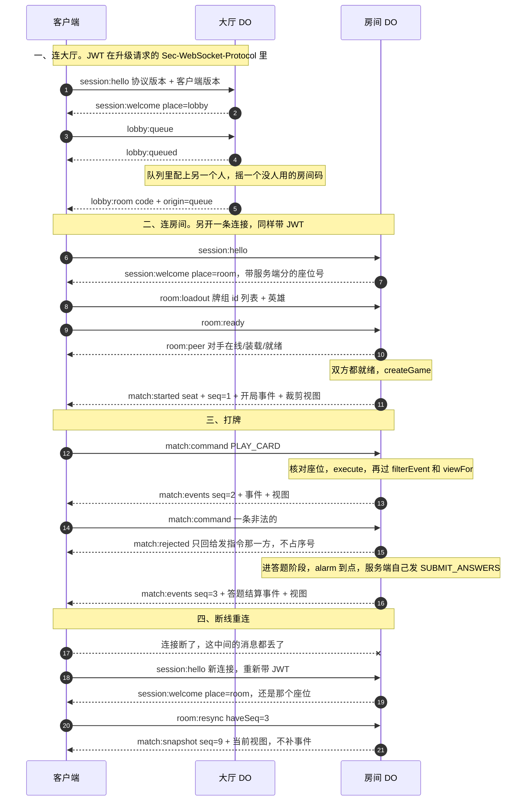

# @ai-duel/protocol

客户端和服务端之间来回传的消息类型。只有 zod schema 和编解码，一行规则都没有——
规则只在服务端的 `core` 里跑（《正式版架构》需求第 6 条）。

依赖只有 `zod` 和 `@ai-duel/core`（7.2 第 1 条）。`content` 只出现在 devDependencies 里，
是测试要一份真卡目录，`src/` 一行都没 import 它。

## 两条连接

大厅和房间是两个 Durable Object（5.2、5.4），所以客户端**先后开两条 WebSocket**：
先连大厅拿房间码，再连房间打牌。一条连接跨不过两个对象。

每条消息是一个 JSON 文本帧，顶层一个 `type` 字符串，风格沿用旧协议的 `域:动作`。
前缀分四类：`session:` 是连接本身，`lobby:` 是大厅，`room:` 是房间成员关系，
`match:` 是对局。唯一不是 JSON 的是心跳，见下面。

## 一局是怎么走的



私人开房是同一条路，只是把 `lobby:queue` 换成 `lobby:create`（拿到码发给朋友）
或 `lobby:join`（照朋友给的码进）。

## 消息清单

### 客户端 → 服务端

| type | 发给谁 | 载荷要点 |
|---|---|---|
| `session:hello` | 大厅 / 房间 | `protocolVersion`（对不上就被拒）、`clientVersion`（只记日志） |
| `lobby:queue` | 大厅 | 无。加入全局匹配队列 |
| `lobby:cancel` | 大厅 | 无。退出队列 |
| `lobby:create` | 大厅 | 无。开一个私人房，服务端摇码 |
| `lobby:join` | 大厅 | `code`：四位数字房间码 |
| `room:loadout` | 房间 | `deck`（卡牌定义 id 列表，可重复）、`hero`（可为 null）。**不报顺序**，洗牌是服务端的事 |
| `room:ready` | 房间 | 无。双方都就绪才开局 |
| `room:leave` | 房间 | 无。主动退出，和掉线不是一回事 |
| `room:resync` | 房间 | `haveSeq`：手上最后一个序号，0 表示一条没收到 |
| `room:urge` | 房间 | `id`：催一催的那句话的 id，**不带文字** |
| `match:command` | 房间 | `command`：只认 `PLAY_CARD` / `END_PLAY` / `USE_HERO_SKILL` / `CONFIRM_ROUND` |

### 服务端 → 客户端

| type | 谁发 | 载荷要点 |
|---|---|---|
| `session:welcome` | 大厅 / 房间 | `protocolVersion`、`userId`、`place`（`lobby`，或 `room` 加房间码和座位号） |
| `session:rejected` | 大厅 / 房间 | `reason` + 一句中文 `notice`。发完就关连接 |
| `lobby:queued` | 大厅 | 无。入队回执 |
| `lobby:canceled` | 大厅 | 无。退队回执 |
| `lobby:room` | 大厅 | `code` + `origin`（`queue` / `create` / `join`）。拿着码去连房间 |
| `lobby:error` | 大厅 | `reason` + `notice`。连接不关 |
| `room:peer` | 房间 | 对手的 `seat` / `online` / `loaded` / `ready`，每次都是完整状态 |
| `room:urged` | 房间 | `from`（哪个座位喊的）+ `id` |
| `room:closed` | 房间 | `reason`（`match-over` / `peer-left` / `idle-timeout`）+ `notice`。别再重连 |
| `room:error` | 房间 | `reason`（含 `not-your-seat`）+ `notice`。连接不关 |
| `match:started` | 房间 | `seat`、`seq`、开局事件、开局后的**完整**裁剪视图（带 `catalog`） |
| `match:events` | 房间 | `seq`、**过完 `filterEvent`** 的事件、这批之后的裁剪视图（`ViewDelta`，**不带 `catalog`**） |
| `match:snapshot` | 房间 | `seq`、当前**完整**裁剪视图（带 `catalog`）。没有事件 |
| `match:rejected` | 房间 | `reason`。只发给发指令那一方 |

### 心跳

`ping` / `pong` 两个**裸字符串**，不是 JSON 消息，所以不在上面两张表里。

这样定是为了配 Durable Object 的 `setWebSocketAutoResponse`：给它一对固定字符串之后，
DO 在休眠中收到 `ping` 由运行时直接回 `pong`，既不唤醒对象也不计费（旧转发器已经这么用了）。
自动应答只认逐字节相等的字符串，包成 JSON 就废了。

客户端定期发 `ping` 有两个用处：保住空闲连接不被中间链路掐掉，
以及靠「发了 ping 却等不到 pong」识破半开连接。

`parseClientMessage('ping')` 会失败，这是对的——它们走不到解析这一步。

## 序号和重同步

1. **序号 `seq` 从 1 开始，按座位各算一串**，不是房间共用一串。
   这样一批事件被 `filterEvent` 对某一方过滤成空时就整条不发，不用为了对齐编号发空包。
2. **只有 `match:started` 和 `match:events` 占号**，每发一条 +1。
   `match:rejected`（指令回执）和 `room:urged`（催一催）不占：
   它们不是「局面上发生的事」，丢了也不影响局面——催一催本来就是故意走不可靠通道的。
3. **客户端记住最后一个号。** 下一条的 `seq` 不等于「上一个 + 1」就是漏包了，发 `room:resync`。
   TCP 不会乱序也不会丢，所以漏包实际只有一个来源：断线期间服务端发出去的那些。
4. **重连也发 `room:resync`**：连上、收到带座位的 `session:welcome` 之后就发，`haveSeq` 填手上最后一个号。
5. **服务端一律回 `match:snapshot`**（完整裁剪视图 + 当前序号），**不补发漏掉的事件**。
   漏掉的演出不再演：对局已经往前走了，补一段迟到的动画只会让画面和局面对不上。
   `haveSeq` 服务端不拿来分支，只写日志——漏了多少、断了多久只有客户端知道。
6. **序号不跨对局**，每局从 1 重新开始。

### 每一批事件都带一份视图

`match:events` 里 `events` 是拿来播动画的，`view` 是这批之后的**唯一真相**。
每批都带，是因为需求第 6 条不许客户端跑规则：客户端要是靠事件自己推算局面，
等于在客户端重写了一遍引擎。所以客户端的规矩只有一条——照 `events` 演完，然后整份换成 `view`。

代价是每批都要发一份视图，而 `PlayerView` 里带着整份卡池（`catalog`），一份视图里九成是卡池。
所以卡池**一局只发一次**：`match:started` 和 `match:snapshot` 带完整 `PlayerView`，
`match:events` 里的是摘掉 `catalog` 的 `ViewDelta`，服务端发前 `stripCatalog`，客户端收到后
`attachCatalog` 把开局那份接回去。不让客户端用自己打包的 `content` 顶替：房间用的是开局那一刻
的目录快照，平衡改动上线后老房间仍按老数值算，本地那份未必一样（细节见 `src/view.ts`）。

## 认证：JWT 走 `Sec-WebSocket-Protocol`

5.5 要求「WebSocket 升级请求带 JWT」。升级请求上能塞东西的地方有三处，挑子协议头：

| 办法 | 为什么不用 / 为什么用 |
|---|---|
| 自定义 header（`Authorization`） | Durable Object 读得到，但浏览器的 `WebSocket` 构造函数根本没有设 header 的入口。四个平台里三个跑在 WebView 上（需求第 1 条），这条路直接断 |
| URL 查询参数 | 能用，但 token 会进 Cloudflare 的请求日志、浏览器历史和各级中间设备的日志。JWT 是凭据，和旧转发器那个无所谓的 `?peer=` 不是一回事 |
| 连上之后第一条消息认证 | 也能用，代价是服务端要容忍一段「已连接但没身份」的窗口：要配超时、要防有人挂着不认证占连接，DO 休眠醒来还得记得这条连接认没认过。多一个状态就多一处会错 |
| **`Sec-WebSocket-Protocol`（选它）** | `new WebSocket(url, protocols)` 的第二个参数，唯一一个各平台都能设的请求头；JWT 的紧凑序列化（base64url + 点）正好都是 RFC 7230 允许的 token 字符，不用再编一层码；客户端用的 partysocket 支持把 protocols 写成函数（`ProtocolsProvider`），每次重连现取一遍，短时效 token 因此能自动续上 |

具体做法：客户端提两个子协议 —— `ai-duel` 和 `jwt.<token>`（`subprotocolsFor(token)` 拼），
服务端用 `authTokenFrom(header)` 取 token，并在 101 响应里**只回显 `ai-duel`**。
必须回显：浏览器发现响应里的子协议不在自己提的名单里会直接判握手失败。

剩下的风险照旧：子协议头一样可能被中间设备记进日志，所以 JWT 要短时效（几分钟级），
泄漏了也很快作废。

这张 token 是客户端拿会话去 `/api/auth/token` 换的，签发方是服务端的 better-auth
（迁移第 25 条，见 `packages/server/README.md`「账号与鉴权」），默认活 15 分钟。
协议这一层只管它怎么传，不管它长什么样——载荷里有什么、用什么算法签，
换签发方时都可能变，而客户端和这份文档都不该跟着改。

**版本号故意不写进子协议名。** 写进去的话版本不对的客户端在握手那一步就被浏览器判失败，
而浏览器拿不到失败握手的响应体，玩家只会看到一个没有细节的 error。
版本比对因此放在第一条消息（`session:hello` 对 `PROTOCOL_VERSION`），
服务端才有机会把「请刷新页面」这句话说出口。

进不去的时候还会带一个关闭码（`CLOSE_UNAUTHORIZED` 那几个常量，4000–4999 区间）：
消息还没送到连接就断了的话，客户端还能从 `CloseEvent` 上认出大类。

## 指令：谁能发什么

`Command` 是这套系统里**唯一一处不可信输入**，所以 command.ts 手写了完整 schema，
服务端在调 `execute` 之前就靠它挡掉畸形指令（6.7 的作弊测试）。九种指令分三类：

| 类 | schema | 联机时谁发 |
|---|---|---|
| 玩家操作（4 种） | `playerCommandSchema` | 客户端，走 `match:command` |
| `SUBMIT_ANSWERS` | `submitAnswersCommandSchema` | **只有服务端**（房间 DO 的答题 autopilot） |
| `DEBUG_*`（4 种） | `debugCommandSchema` | **联机时谁都不能发** |

- **`SUBMIT_ANSWERS` 不进联机通道**是一条防作弊线：那条指令直接决定谁答对、谁得分，
  客户端能发就等于能宣布自己全对。5.3 已经把答题 autopilot 搬进服务端（延时用 DO 的 alarm、
  密钥也在服务端），所以它根本不该出现在电线上。
- **`DEBUG_*` 同理**：它们能凭空造牌、跳过阶段。引擎自己不做来源限制（见 core 的 `Command` 注释），
  挡住它们是这一层和服务端的事。单机和教程的 `localDriver` 想用就用
  `debugCommandSchema` / `commandSchema`，那条路不过网。
- 指令里的 `player` 字段**是不是发送方自己的座位由服务端核对**，schema 看不见「谁在发」。
  这是 6.7 那条「用对方座位发指令要被拒」的落点。

`commandSchema`（九种全有）只给单机 driver、测试和对表用。**联机通道不要用它**。

## 和 core 的类型怎么钉在一起

- 每个 schema 后面一句 `satisfies z.ZodType<核心类型>`：schema 造得出 core 没有的形状就编译报错。
- command.ts 末尾两条 `Assert`：`Command extends z.infer<typeof commandSchema>` 管
  「core 加了一种指令而这里漏了分支」——那一种光靠 `satisfies` 是不响的。
- 测试里再对一次账：`commandSchema.options` 的分支列表要和穷举表（core `engine.test.ts` 里
  用过的每种指令 type）逐字相等。类型层面和运行时各一道。

事件（`GameEvent`）和视图（`PlayerView`）**故意只粗筛不深校验**：它们是服务端算出来的，
只往客户端一个方向走，客户端不需要防着自己的服务端。抄一份三十来种分支的事件 schema，
换来的只是 core 每加一种事件就要在这里再改一遍。

## 解析

```ts
parseClientMessage(input: unknown): { ok: true; value: ClientMessage } | { ok: false; error: string }
parseServerMessage(input: unknown): { ok: true; value: ServerMessage } | { ok: false; error: string }
```

返回值而不是抛异常：网络上进来的东西本来就可能是任何形状，解析失败是**正常路径**。
抛出去的话每个调用点都得包一层 try/catch，漏一处就是一条连接被一段乱码搞崩。

可以直接把 WebSocket 事件里的东西丢进去：字符串会先 `JSON.parse`（parse 失败也走
`{ ok: false }`），已经是对象就直接校验。

**严松不对称**：客户端发上来的消息用 `z.strictObject`（多一个字段整条拒），
服务端发下去的用 `z.object`（多出来的字段悄悄丢掉）。方向不同防的东西也不同——
上行是不可信输入，多出来的字段本身就是可疑信号；下行来自自家服务端，
宽一点是为了让服务端能先上线带新字段的版本，老客户端不至于当场炸。

## 协议版本

`PROTOCOL_VERSION` 在 version.ts。**什么时候要 +1**：任何一条消息的形状发生不兼容变化——
加必填字段、改字段类型、删一种消息、改一个 `type` 字符串。
加可选字段或整加一种新消息不用动它（下行是宽松解析的）。

项目还没上线、不留兼容层（见 AGENTS.md），所以永远只有一个当前值，
不存在「服务端同时支持 v1 和 v2」这回事。
